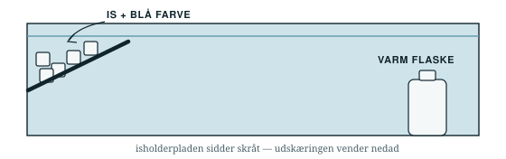

```{=typst}
#let linje(n) = {
  for _ in range(n) {
    v(1.2em)
    line(length: 100%, stroke: 0.6pt + rgb("#9FB0AF"))
  }
  v(0.4em)
}
#let felt(h) = {
  v(0.5em)
  rect(width: 100%, height: h, stroke: 0.7pt + rgb("#9FB0AF"), fill: rgb("#F3F6F6"), radius: 2pt)
  v(0.5em)
}
#let boks(body) = {
  v(0.4em)
  block(width: 100%, inset: 8pt, radius: 2pt, fill: rgb("#ECF1F1"),
        text(font: "DejaVu Sans Mono", size: 9.5pt, body))
  v(0.4em)
}

#v(-0.4em)
#text(size: 9.5pt, fill: rgb("#5A6F76"))[Navne: #box(width: 8cm, repeat[.])]
#v(0.4em)
#line(length: 100%, stroke: 1.2pt + rgb("#14262E"))
```

I skal bygge en model af det, der sker ud for Grønlands kyst hver vinter.
Isen er jeres Grønland. Flasken med varmt vand er Golfstrømmen.

**1. Gør klar.** Fyld karret med lunkent vand, til det står lige over
isholderpladen. Sæt pladen i den ene ende med *udskæringen nedad*. Stil flasken
med varmt vand i den anden ende. Rør ikke ved isen endnu.

**2. Gæt først — hver for sig.** Om lidt lægger I is med blå farve på pladen.
Tegn med en pil, hvor I tror det blå vand løber hen. Alle i gruppen tegner deres
eget gæt.

{width=100%}

**3. Sæt den i gang.** Læg knust is i et lag på pladen. Dryp
**et par dråber blå farve ned på isen** — ikke i vandet. Hold sort karton bag
karret. Kig i tre minutter uden at røre noget.

**4. Tegn hvad der faktisk skete** oven i jeres gæt ovenfor, med en anden farve.
Tag også et billede med telefonen.

**5. Hvilken vej løb det blå vand?**

```{=typst}
#linje(1)
```

**6. Løb der noget den modsatte vej henne oppe ved overfladen?**

```{=typst}
#linje(1)
```

**7. Isen på pladen er næsten ferskvand.** Saltet fra havisen bliver efterladt i
vandet under den. Hvorfor gør det vandet endnu tungere end kulden alene?

```{=typst}
#linje(2)
```

**8. Ryd op:** tøm karret i vasken, stil det tilbage, og læg ny is klar til næste
gruppe. Det næste hold skal bruge rent vand.
