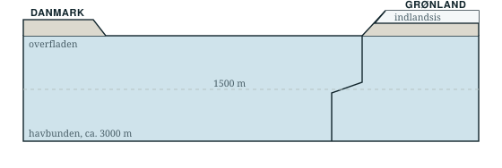

```{=typst}
#let linje(n) = {
  for _ in range(n) {
    v(1.2em)
    line(length: 100%, stroke: 0.6pt + rgb("#9FB0AF"))
  }
  v(0.4em)
}

#v(-0.4em)
#text(size: 9.5pt, fill: rgb("#5A6F76"))[Navne: #box(width: 8cm, repeat[.])]
#v(0.4em)
#line(length: 100%, stroke: 1.2pt + rgb("#14262E"))
```

Densitet er, hvor meget en kubikmeter vand vejer. Koldt vand er tungere end
varmt. Salt vand er tungere end ferskvand. Her er fire rigtige vandmasser fra
Nordatlanten.

| Vandmasse | Temperatur | Salt | Densitet | Nr. |
|:---------------------------|-----------:|--------:|---------------:|:---:|
| Golfstrømmen ved overfladen | 12 °C | 35,5 ‰ | 1026,9 kg/m³ | \_\_\_ |
| Grønlandshavet om vinteren | −1 °C | 34,9 ‰ | 1028,1 kg/m³ | \_\_\_ |
| Dybvand, 3000 m nede | 2 °C | 34,9 ‰ | 1027,9 kg/m³ | \_\_\_ |
| Smeltevand fra indlandsisen | 1 °C | 0 ‰ | 1000,0 kg/m³ | \_\_\_ |

**1. Nummerér** vandmasserne i kolonnen yderst til højre: 1 = tungest,
4 = letteste.

**2. Sammenlign Golfstrømmen og dybvandet.** Golfstrømmen har faktisk *mest*
salt af de to — og er alligevel lettest. Hvad er forklaringen?

```{=typst}
#linje(1)
```

**3. Tegn pumpen.** På tegningen: sæt en **rød** pil, hvor det varme vand
strømmer nordpå ved overfladen, en **blå** pil, hvor det tunge vand synker ned
ved Grønland, og en blå pil, der viser det løbe sydpå langs bunden.

{width=86%}

**4. Hvor på tegningen sker det samme, som sker i karret** henne ved den anden
halvdel af klassen? Sæt et kryds.

**5. Smeltevandet.** Grønlands indlandsis smelter hurtigere og hurtigere, og
smeltevandet løber ud i havet præcis dér, hvor det tunge vand plejer at synke.
Kig på densiteterne i skemaet igen. Hvad tror I, der sker med pumpen? Og hvad kan
det betyde for vejret i Danmark?

```{=typst}
#linje(2)
```

**6. Ét spørgsmål med videre.** Skriv ét spørgsmål, I gerne vil have svar på.
Læreren læser nogle af dem op til sidst.

```{=typst}
#linje(1)
```
