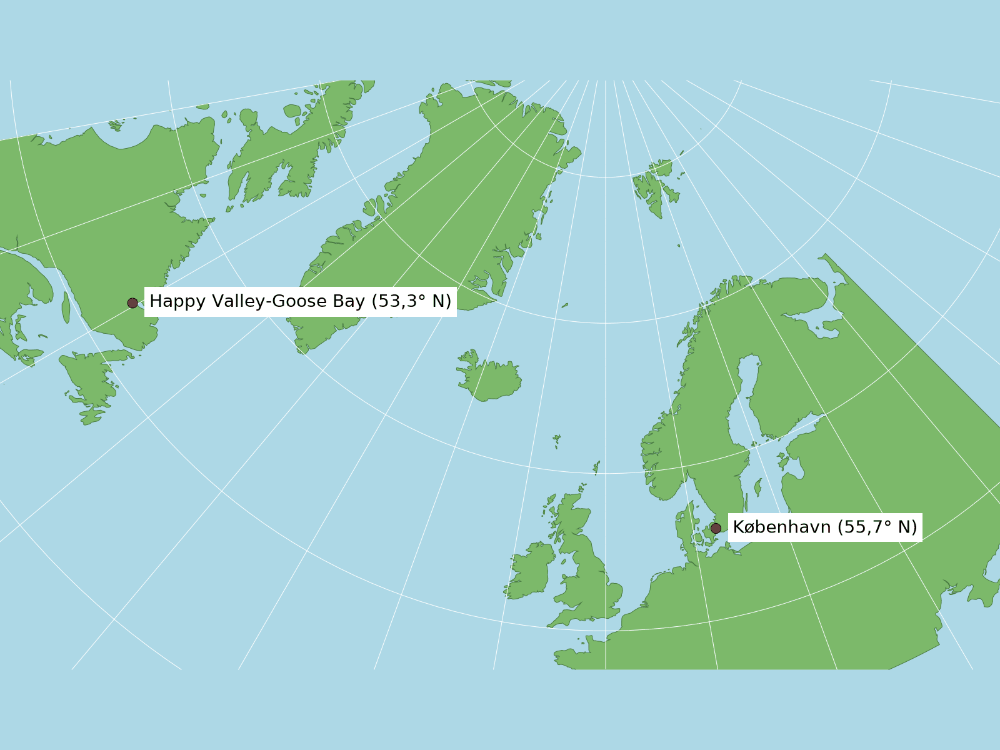
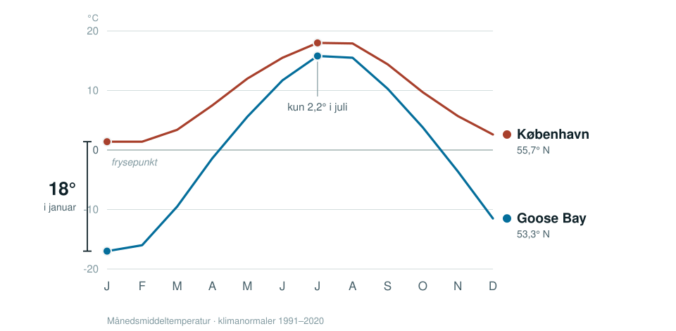
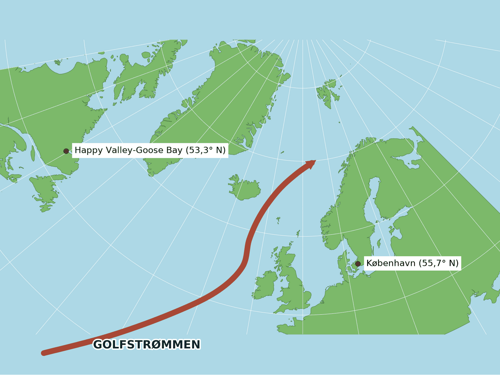
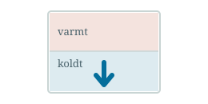
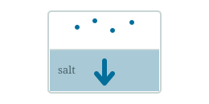
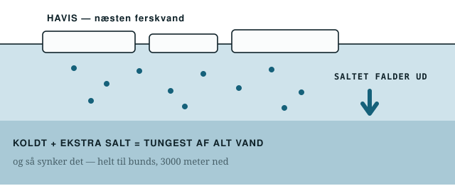
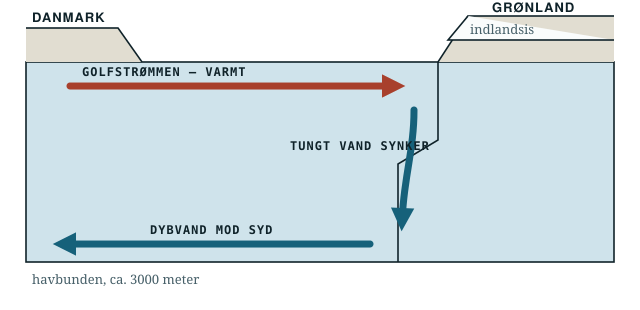

## To byer — og København ligger nordligst

::: {.eyebrow}
Første spørgsmål
:::

:::: {.columns}

::: {.column width="60%"}
::: {.kort}

:::
[Klimanormaler 1991–2020]{.kort-tekst}
:::

::: {.column width="40%"}
::: {.by .varm}
**København**
[55,7° nord · Danmark]{.sted}
[+1,4 °C]{.grad}
[middel i januar · året rundt 9,2 °C]{.aar}
:::

::: {.by}
**Happy Valley-Goose Bay**
[53,3° nord · Labrador, Canada]{.sted}
[−17 °C]{.grad}
[middel i januar · året rundt 0,4 °C]{.aar}
:::
:::

::::

::: {.notes}
Skriv de to byer op. Pointen er ikke bare kulden — det er at København ligger
LÆNGERE MOD NORD end Goose Bay og alligevel er 18 grader varmere i januar.
Om sommeren er de næsten ens: 18,0 mod 15,8 °C. Så det er vinteren, der er mærkelig.
:::

## 18 graders forskel — og kun om vinteren

::: {.eyebrow}
Gæt — I har ét minut
:::

{width=94%}

::: {.daemp}
Om sommeren er de to byer næsten ens. Det er **vinteren**, der er mærkelig — og
København ligger endda længere mod nord. Så det er ikke afstanden til polen.
:::

::: {.notes}
Lad dem gætte i et minut. Notér gættene på tavlen. Afslør ikke svaret —
sig at halvdelen af dem om lidt bygger svaret i et kar.
:::

## Golfstrømmen henter varme sydfra

::: {.eyebrow}
Svarets første halvdel
:::

::: {.kort}
{width=72%}
:::

::: {.daemp}
Varmt overfladevand fra Mexicogolfen løber hele vejen op langs Europa og forbi
Danmark. Labrador får ingenting. **Men hvor bliver alt det vand så af?**
:::

::: {.notes}
Tegn gerne pilen efter med kridt-værktøjet (tryk B). Slut med spørgsmålet:
vandet kan ikke hobe sig op deroppe — så hvor bliver det af?
:::

## Densitet — hvor tungt vandet er

::: {.eyebrow}
Nøgleordet
:::

:::: {.columns}

::: {.column width="48%"}
::: {.fakta}

### Koldt vand er tungere

Det lægger sig nederst og skubber det varme op.
:::
:::

::: {.column width="48%"}
::: {.fakta}

### Salt vand er tungere

Havvand indeholder cirka 35 gram salt pr. liter.
:::
:::

::::

::: {.daemp}
Det tungeste vand i hele Atlanterhavet er derfor det, der er **både iskoldt og
ekstra salt**.
:::

::: {.notes}
Skriv ordet DENSITET på tavlen. For de fleste 8.-klasser er det første gang.
To ting gør vand tungt: kulde og salt.
:::

## Når havis fryser, bliver saltet efterladt

::: {.eyebrow}
Det man ikke kan gætte
:::

{width=88%}

::: {.notes}
Dette er lektionens ene ikke-intuitive fakta: havis er næsten ferskvand.
Saltet bliver efterladt i vandet under isen. Det vand er nu både iskoldt
OG ekstra salt — tungest af alt vand i Atlanterhavet.
:::

## Noget synker — så må noget andet rykke ind

::: {.eyebrow}
Grønlandspumpen
:::

{width=88%}

::: {.notes}
Det tunge vand synker 3000 meter ned langs Grønlands kyst og løber sydpå
langs bunden. Når noget synker, skal noget andet rykke ind — og det er
Golfstrømmens varme vand. Pumpen er i gang.
:::

## Derfor er København ikke som Goose Bay

::: {.eyebrow}
Svaret
:::

::: {.trin}
1. Ved Grønland fryser havis om vinteren, og **saltet bliver efterladt i vandet nedenunder**.
2. Det vand er nu både iskoldt og ekstra salt — **tungest af alt vand i Atlanterhavet** — og synker 3000 meter ned.
3. Når noget synker, skal noget andet rykke ind. **Golfstrømmen suges nordpå** — og den har varmen med.
4. Nordvesteuropa får varmen. Labrador ligger på den forkerte side af Atlanten. **Det er de 18 grader i januar.**
:::

::: {.notes}
Luk cirklen. Peg tilbage på kortet fra slide 2.
:::

## Hvad nu hvis Grønlands is smelter?

::: {.eyebrow}
Og så det, forskerne holder øje med
:::

| Vandmasse | Temperatur | Salt | Densitet |
|:---|---:|---:|---:|
| Grønlandshavet om vinteren | −1 °C | 34,9 ‰ | **1028,1 kg/m³** |
| Dybvand, 3000 m nede | 2 °C | 34,9 ‰ | 1027,9 kg/m³ |
| Golfstrømmen ved overfladen | 12 °C | 35,5 ‰ | 1026,9 kg/m³ |
| Smeltevand fra indlandsisen | 1 °C | 0 ‰ | 1000,0 kg/m³ |

::: {.daemp}
Smeltevand er ferskt og dermed **det letteste vand på listen**. Det lægger sig som
et låg lige dér, hvor det tunge vand plejer at synke. Det vender vi tilbage til
til sidst.
:::

::: {.notes}
Det er den samme tabel, Ark B-holdet arbejder med. Nævn at Golfstrømmen
faktisk har MEST salt af de tre havvandsmasser og alligevel er lettest —
fordi den er varm.
:::

## To hold, to opgaver

::: {.eyebrow}
Nu skal I arbejde — 12 minutter, så bytter vi
:::

:::: {.columns}

::: {.column width="48%"}
::: {.hold}
[Hold Blå · ved karrene]{.navn}

### Byg pumpen

Fyld selv karret med lunkent vand. Is med blå farve i den ene ende, varm flaske
i den anden. Gæt først, kig så — og tegn hvad der skete.
:::
:::

::: {.column width="48%"}
::: {.hold .gul}
[Hold Gul · ved bordene]{.navn}

### Find det tungeste vand

Fire rigtige vandmasser fra Nordatlanten skal rangordnes efter densitet.
Bagefter tegner I selv pumpen ind på et tværsnit af havet.
:::
:::

::::

::: {.daemp}
Én regel ved karrene: **den blå farve skal på isen — ikke ned i karret.**
:::

::: {.notes}
Lad denne slide blive stående på lærredet, mens de finder på plads.
Sig højt, at de bytter om tolv minutter.
:::
