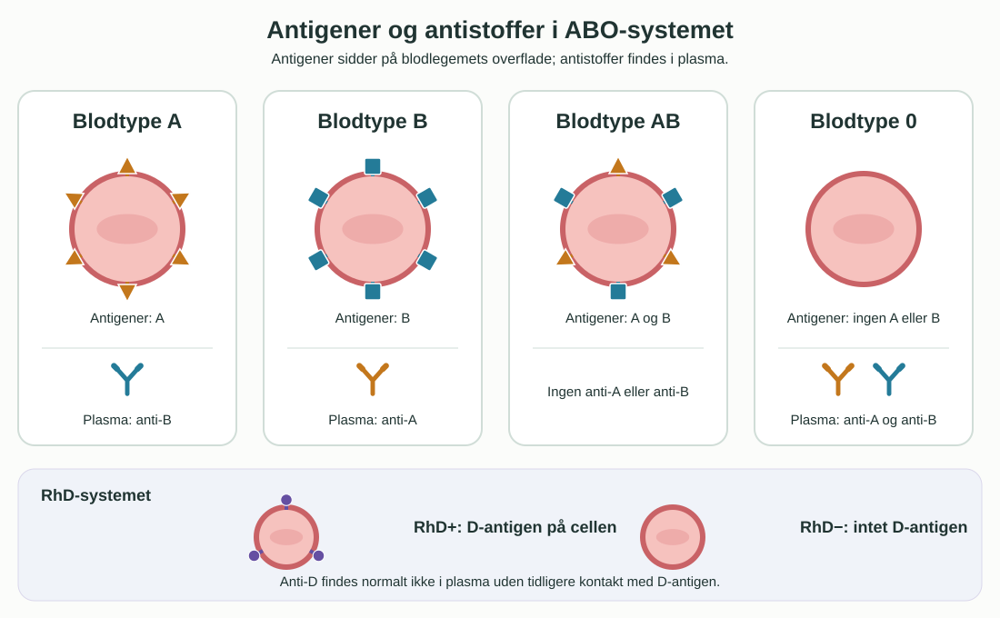
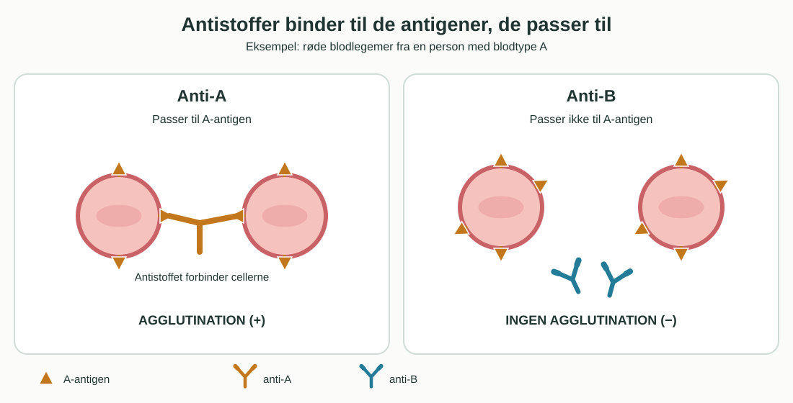

**Dato:** \_\_\_\_\_\_\_\_\_\_\_\_\_\_\_\_\_\_\_\_\_\_ &nbsp;&nbsp; **Gruppe / navne:** \_\_\_\_\_\_\_\_\_\_\_\_\_\_\_\_\_\_\_\_\_\_

## Om øvelsen

I dag skal I undersøge, om røde blodlegemer klumper sammen med anti-A, anti-B og anti-D. Ud fra reaktionerne bestemmer I ABO- og RhD-blodtype. Bagefter undersøger I, hvilke genotyper resultatet er foreneligt med, og sammenligner klassens fordeling med en referencefordeling.

## Baggrund

På overfladen af røde blodlegemer kan der sidde A- og B-antigener. Blodtype A har A-antigen, B har B-antigen, AB har begge, og 0 har ingen af dem. RhD-positivt blod har desuden D-antigen; RhD-negativt blod har det ikke. Blodplasma indeholder normalt antistoffer mod de ABO-antigener, som ens egne røde blodlegemer mangler. Anti-D opstår derimod normalt først efter påvirkning fra RhD-positive blodlegemer.

{#fig-blodtype-antigener width="95%"}

Når et passende antistof binder til antigener på flere røde blodlegemer, kan cellerne danne synlige klumper. Det kaldes **agglutination**. Reaktion med anti-A viser A-antigen; reaktion med anti-B viser B-antigen; reaktion med anti-D tyder på D-antigen. Hvis en reaktion er uklar, kan blodtypen ikke bestemmes sikkert ud fra prøven.

{#fig-agglutination width="95%"}

ABO-systemet har tre almindelige alleler: $I^A$, $I^B$ og $i$. $I^A$ og $I^B$ er kodominante, mens $i$ er recessiv. Derfor kan fænotypen A svare til $I^AI^A$ eller $I^Ai$, mens AB kun svarer til $I^AI^B$. I en forenklet arvegang kan RhD-positiv beskrives med mindst én $D$-allel ($DD$ eller $Dd$) og RhD-negativ med $dd$. En blodtypeprøve alene afgør ikke, hvilken af to mulige genotyper en person har.

::: {.callout-note}
## Materialer (pr. gruppe)

- Ren spotplade af porcelæn med 12 fordybninger (én plade til op til fire forsøgspersoner)
- Anti-A, anti-B og anti-D efter lærerens anvisning
- Tre separate engangsrørepinde pr. forsøgsperson
- Steril engangslancet, desinfektionsserviet, gaze og plaster
- Engangshandsker, beholder til skarpe genstande og pose til blodforurenet affald
- Evt. telefon til foto, uden navn eller ansigt i billedet
:::

::: {.callout-important}
## Sikkerhed

- Forsøgspersonen håndterer sin egen finger og bloddråbe. Læreren instruerer og fører tilsyn. Brug en ny engangslancet til hver person; den må aldrig deles eller genbruges.
- Vask hænder før og efter. Rens og tør stikkestedet. Dæk såret efter prøven. Brug handsker ved håndtering af blodforurenet udstyr.
- Lancetten lægges straks i beholderen til skarpe genstande; øvrigt blodforurenet materiale bortskaffes efter lærerens anvisning. Rengør arbejdspladsen.
- En skoleøvelse kan ikke bruges som dokumentation ved transfusion, graviditet eller anden behandling.
:::

## Fremgangsmåde

1. Fordel spotpladens 12 fordybninger mellem højst fire forsøgspersoner: **tre fordybninger pr. person**. Aftal på forhånd, hvilke tre der hører til hvem, og mærk eller tegn en oversigt over placeringen. Betegn hver persons fordybninger **A**, **B** og **D**.
2. Placér anti-A, anti-B og anti-D i de tilsvarende fordybninger. Læg én ubrugt rørepind ved hver fordybning. Hold flaskespidser fri af blod og undgå, at væske løber mellem fordybningerne.
3. Forsøgspersonen vasker hænder, renser fingeren og lader den tørre. Prik med en steril engangslancet efter lærerens instruktion. Undgå at berøre fordybningen med fingeren.
4. Fordel små bloddråber i personens tre fordybninger efter reagensernes anvisning. Bland hver fordybning med **sin egen** rørepind. Brug aldrig samme pind i to fordybninger eller til to personer.
5. Vip spotpladen roligt, og aflæs inden for den tid, der står på reagensernes vejledning. Se efter tydelige klumper i den tynde blodfilm; en jævnt fordelt film regnes som negativ.
6. Notér **+**, **−** eller **uklar** for hver fordybning i @tbl-resultat. Tag evt. et foto. Ved uklar reaktion: skriv *kan ikke bestemmes*, og spørg læreren før en eventuel ny test.

## Resultater

**Forsøgsperson:** \_\_\_\_\_\_\_\_\_\_\_\_\_\_

| Anti-A | Anti-B | Anti-D | ABO-type | RhD | Samlet blodtype |
|:---:|:---:|:---:|:---:|:---:|:---:|
| | | | | | |

: Registrér agglutination som +, ingen agglutination som − og tvivlsom reaktion som uklar. {#tbl-resultat}

**Foto eller skitse af de tre fordybninger:**

\_\_\_\_\_\_\_\_\_\_\_\_\_\_\_\_\_\_\_\_\_\_\_\_\_\_\_\_\_\_\_\_\_\_\_\_\_\_\_\_\_\_\_

## Databehandling

1. Aflæs ABO-typen: kun anti-A positiv = A; kun anti-B positiv = B; begge positive = AB; begge negative = 0. Positiv anti-D giver RhD+, negativ anti-D giver RhD−. Skriv de mulige ABO-genotyper og, med den forenklede model i baggrunden, mulige RhD-genotyper for jeres resultat.
2. Saml klassens entydige resultater. Udelad uklare prøver fra beregningen, og notér hvor mange der blev udeladt. Tæl hver af de fire ABO-typer og begge RhD-typer. Brug samme antal gyldige prøver $N$ som nævner:

$$\text{Andel i procent} = \frac{\text{antal med blodtypen}}{N}\cdot 100\,\%$$

| Type | A | B | AB | 0 | RhD+ | RhD− |
|:---|:---:|:---:|:---:|:---:|:---:|:---:|
| Antal | | | | | | |
| Andel (%) | | | | | | |
| Danmark (%) | 44 | 10 | 5 | 41 | 84 | 16 |

: Klassens fordeling og fordelingen i Danmark. ABO-kolonnerne summerer til $N$ og 100 %, og det samme gør de to RhD-kolonner. De danske andele er beregnet ud fra [Bloddonorerne Danmarks fordeling af de otte blodtyper](https://bloddonor.dk/fakta-om-blod/blodtyper/). {#tbl-fordeling}

3. Lav et søjlediagram for klassens fire ABO-andele. Sammenlign med fordelingen i Danmark i @tbl-fordeling. Beregn forskellen i procentpoint for hver type: klassens andel minus Danmarks andel. Sammenlign også RhD+ og RhD−. Diskutér, hvad klassens størrelse betyder for sammenligningen.

## Journalspørgsmål

1. Forklar med jeres egne observationer, hvorfor en positiv reaktion med anti-A betyder, at de røde blodlegemer har A-antigen. Hvad viser en negativ reaktion med anti-B?
2. Hvilke ABO-genotyper er mulige for hver af typerne A, B, AB og 0? Forklar kodominans og recessivitet med et eksempel.
3. En forælder har blodtype A og den anden B. Hvilke blodtyper kan et barn få, hvis begge forældre er heterozygote? Vis et krydsningsskema.
4. Hvilke ABO- og RhD-typer kan en person med jeres bestemte blodtype som udgangspunkt modtage **røde blodlegemer** fra? Forklar med antigener og antistoffer. Hvorfor må en klasseøvelse ikke afgøre en virkelig transfusion?
5. Hvilke praktiske fejl kan give falsk eller tvivlsom agglutination? Brug fremgangsmåden til at foreslå, hvordan I mindsker mindst to af dem.
6. Hvor godt ligner klassens fordeling referencefordelingen?
