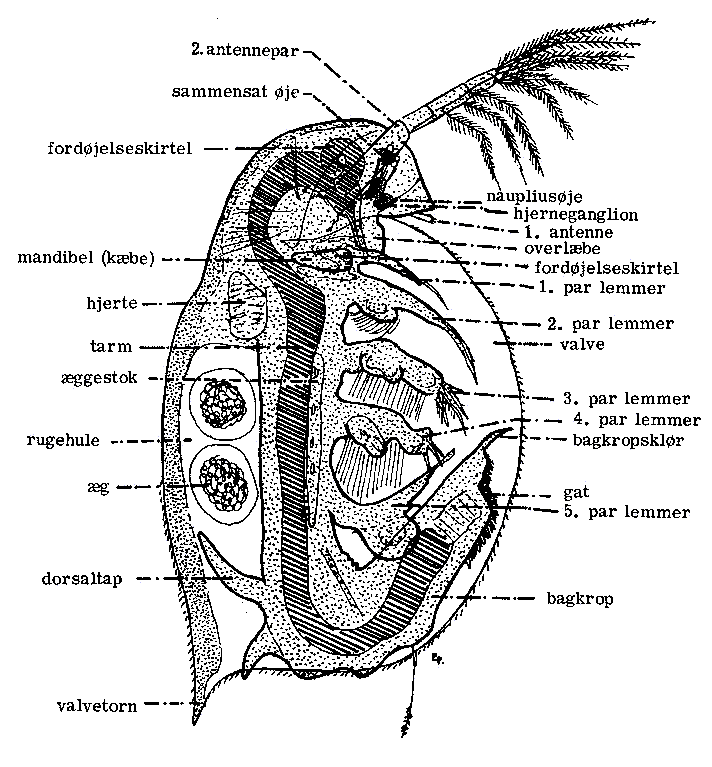

**Dato:** \_\_\_\_\_\_\_\_\_\_\_\_\_\_\_\_\_\_\_\_ &nbsp;&nbsp;&nbsp;&nbsp; **Gruppe / navne:** \_\_\_\_\_\_\_\_\_\_\_\_\_\_\_\_\_\_\_\_\_\_\_\_\_\_\_\_\_\_\_\_\_\_\_\_\_\_\_\_\_\_\_\_

## Om øvelsen

I dag skal I undersøge, hvordan koffein påvirker en dafnies hjerterytme. Dafnien er gennemsigtig, så I kan se dens hjerte slå direkte i mikroskopet, mens I tilsætter kaffeopløsninger med stigende koncentration.

## Fremgangsmåde

### A. Fremstilling af kaffeopløsninger (fortyndingsrække)

1. Opløs 2 g instant kaffe i 100 mL vand. Det giver en stamopløsning på 600 mg koffein/L (ud fra et gennemsnitligt koffeinindhold på 30 mg pr. gram instant kaffe).
2. Lav en fortyndingsrække ved at halvere koncentrationen i hvert trin: bland 50 mL af den foregående opløsning med 50 mL vand for at få den næste. Fortsæt, til I har seks opløsninger: 600, 300, 150, 75, 37,5 og 18,75 mg/L.
3. Mærk hvert glas tydeligt med koncentrationen.

### B. Dafniens hjerterytme uden og med koffein

1. Fang en dafnie forsigtigt med en pipette med afklippet spids, og læg den på et objektglas med 2 dråber vand. Læg et dækglas over.
2. Indstil mikroskopet, så I tydeligt kan se dafnien og dens hjerte slå. Tegn den, eller tag et billede.

   Hjertet sidder på "ryggen" af dafnien, se Figur 1.

   {#fig-dafnie-anatomi width="55%"}

3. Tæl hjerteslagene i 15 sekunder, og gang med 4. Gør det 3 gange, og notér resultaterne i skemaet under "0 mg/L".
4. Sluk lyset i mikroskopet, så snart I ikke kigger — for meget lys/varme fra lyskilden skader dafnien og forstyrrer resultatet.
5. Tag dækglasset af, og tilsæt et par dråber af opløsningen med den laveste koffeinkoncentration (18,75 mg/L). Læg dækglasset på igen.
6. Se i mikroskopet, hvordan dafniens hjerte reagerer, og tæl hjerteslagene igen som i trin 3.
7. Gentag trin 4–6 med de næste koncentrationer i stigende rækkefølge, indtil I har afprøvet alle seks.

::: {.callout-tip}
## Tip

Hold igen med lyset mellem tællingerne — det er den hyppigste årsag til, at dafnien tager skade før tid. Har I flere dafnier i kulturen, så skift til en frisk en, hvis den, I er i gang med, ser ud til at dø undervejs.
:::

::: {.callout-note}
## Materialer (pr. gruppe)

- Lysmikroskop
- Objektglas (evt. hul-objektglas) og dækglas
- Dafnier fra kulturkar
- Pipette med afklippet spids (til at fange dafnier skånsomt)
- Instant kaffe og vand
- 6 mærkede glas til fortyndingsrækken
- Målebæger eller målecylinder (100 mL)
- Ur eller stopur
- Blyant og papir til tegninger
:::

## Registrering af målinger

| Koffeinkoncentration | 1. gang | 2. gang | 3. gang | Gennemsnit | Noter |
|:---|:---:|:---:|:---:|:---:|:---|
| 0 mg/L (uden koffein) | | | | | |
| 18,75 mg/L | | | | | |
| 37,5 mg/L | | | | | |
| 75 mg/L | | | | | |
| 150 mg/L | | | | | |
| 300 mg/L | | | | | |
| 600 mg/L | | | | | |

: Antal hjerteslag pr. minut hos dafnien ved stigende koffeinkoncentration.
