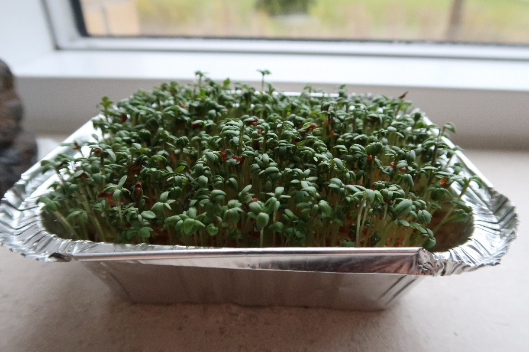

**Dato:** \_\_\_\_\_\_\_\_\_\_\_\_\_\_\_\_\_\_\_\_ &nbsp;&nbsp;&nbsp;&nbsp; **Gruppe / navne:** \_\_\_\_\_\_\_\_\_\_\_\_\_\_\_\_\_\_\_\_\_\_\_\_\_\_\_\_\_\_\_\_\_\_\_\_\_\_\_\_\_\_\_\_

## Om øvelsen

I skal undersøge højdevæksten hos havekarse (*Lepidium sativum*) som funktion af tid og af lys. Karse er en urt, der kan dyrkes indendørs hele året. Frøene spirer, når de holdes fugtige, og planterne vokser, hvis de kan lave fotosyntese — det vil sige, hvis de har adgang til carbondioxid, vand og lys. Planter i mørke kan ikke lave fotosyntese.

Hver gruppe får to bakker med vat og karsefrø: den ene skal stå lyst, den anden mørkt. Forsøget løber over ca. 14 dage, og I skal vande og måle jeres planter hver dag. I ser altså på karsen som en primærproducent — en fotoautotrof organisme — og på formen af vækstkurverne.

{#fig-karse width="70%"}

## Hypotese

Skriv hypoteserne ned, **før** I sætter forsøget i gang.

**1. Karsens højdevækst som funktion af tid:**

\_\_\_\_\_\_\_\_\_\_\_\_\_\_\_\_\_\_\_\_\_\_\_\_\_\_\_\_\_\_\_\_\_\_\_\_\_\_\_\_\_\_\_\_\_\_\_\_\_\_\_\_\_\_\_\_\_\_\_\_\_\_\_\_\_\_\_\_\_\_\_\_\_\_\_\_\_\_\_\_\_\_\_\_\_\_\_\_

\_\_\_\_\_\_\_\_\_\_\_\_\_\_\_\_\_\_\_\_\_\_\_\_\_\_\_\_\_\_\_\_\_\_\_\_\_\_\_\_\_\_\_\_\_\_\_\_\_\_\_\_\_\_\_\_\_\_\_\_\_\_\_\_\_\_\_\_\_\_\_\_\_\_\_\_\_\_\_\_\_\_\_\_\_\_\_\_

**2. Karsens højdevækst som funktion af lys:**

\_\_\_\_\_\_\_\_\_\_\_\_\_\_\_\_\_\_\_\_\_\_\_\_\_\_\_\_\_\_\_\_\_\_\_\_\_\_\_\_\_\_\_\_\_\_\_\_\_\_\_\_\_\_\_\_\_\_\_\_\_\_\_\_\_\_\_\_\_\_\_\_\_\_\_\_\_\_\_\_\_\_\_\_\_\_\_\_

\_\_\_\_\_\_\_\_\_\_\_\_\_\_\_\_\_\_\_\_\_\_\_\_\_\_\_\_\_\_\_\_\_\_\_\_\_\_\_\_\_\_\_\_\_\_\_\_\_\_\_\_\_\_\_\_\_\_\_\_\_\_\_\_\_\_\_\_\_\_\_\_\_\_\_\_\_\_\_\_\_\_\_\_\_\_\_\_

Tænk også over, hvilken farve planterne får under de to betingelser.

## Fremgangsmåde

### A. Opstilling (dag 0)

1. Læg et lag vat i hver af de to bakker, og fugt vattet med vand fra hanen, indtil det er vådt hele vejen igennem. Brug **samme mængde vat og vand** i de to bakker — hvorfor er det vigtigt?
2. Fordel karsefrøene jævnt i de to bakker. Brug også her samme mængde i begge bakker.
3. Mærk bakkerne med gruppens navn og med "lys" og "mørke".
4. Stil den ene bakke lyst, fx i en vindueskarm, og den anden mørkt i et skab eller en lukket kasse. Bakken i mørke må **ikke** få lys undervejs.
5. Mål højden i begge bakker med det samme (den er 0 cm), og skriv dato og klokkeslæt i skemaet.

### B. Daglige målinger (dag 1–14)

1. Vand begge bakker, så vattet holdes vådt. Planterne skal **ikke** gødes.
2. Mål planternes højde i hver bakke med en lineal, og notér målingerne i skemaet sammen med dato, klokkeslæt og en kort observation (farve, udseende, hvor mange frø der er spiret).
3. Tag fotos af begge bakker undervejs — ikke nødvendigvis hver dag — som dokumentation. Skriv i skemaet, hvornår I har taget billeder.

::: {.callout-tip}
## Tip

- Mål så vidt muligt på samme tidspunkt hver dag, så der går ca. 24 timer mellem målingerne, og brug **samme lineal** hele forsøget igennem. Det er en del af variabelkontrollen.
- Aftal i gruppen, om begge bakker står hos den samme elev hele forsøget, eller om de går på tur. Bakkerne skal passes hver dag — også i weekenden.
- Fordampningen kan være stor i en vindueskarm med fuld sol. Er I hjemmefra i mere end 8 timer, så vand, før I tager i skole. Tørrer vattet ud, dør planterne.
- Vil I have flere data at behandle, kan I tælle et fast antal frø op i hver bakke (fx 100) og undervejs tælle, hvor mange der er spiret. Så kan I også beregne en spiringsprocent.
:::

::: {.callout-note}
## Materialer (pr. gruppe)

- 2 aluminiumsbakker med låg
- Bomuldsvat
- Karsefrø
- Vand fra hanen
- Lineal (den samme hele forsøget igennem)
- Ur til tidtagning
- Kamera (fx mobiltelefon) til dokumentation
- Et skab eller en lukket kasse til bakken i mørke
:::

## Registrering af målinger

| Dato | Kl. | Lys (cm) | Mørke (cm) | Observationer | Foto |
|:--|:--|:-:|:-:|:---|:-:|
| *8/9* | *18:00* | *0* | *0* | *Frøene er ikke spiret endnu* | *Ja* |
| *9/9* | *18:05* | *0,1* | *0* | *Lys: ca. 5 % af frøene er begyndt at spire* | *Nej* |
|  |  |  |  |  |  |
|  |  |  |  |  |  |
|  |  |  |  |  |  |
|  |  |  |  |  |  |
|  |  |  |  |  |  |
|  |  |  |  |  |  |
|  |  |  |  |  |  |
|  |  |  |  |  |  |
|  |  |  |  |  |  |
|  |  |  |  |  |  |
|  |  |  |  |  |  |
|  |  |  |  |  |  |
|  |  |  |  |  |  |
|  |  |  |  |  |  |
|  |  |  |  |  |  |
|  |  |  |  |  |  |

: Karsens højde (cm) i lys og i mørke, målt én gang i døgnet. De to første rækker er et eksempel på, hvordan skemaet udfyldes.

## Databehandling og rapport

1. **Resultater.** Beskriv i hele sætninger, hvad I observerede i løbet af de 14 dage. Hvad var sammenhængen mellem planternes højde og tiden? Hvad var sammenhængen mellem planternes højde og lyset? Henvis til skemaet og til jeres fotos med figurnummer og figurtekst.
2. **Grafer.** Lav 2–4 grafer over karsens højdevækst som funktion af tiden — husk, at I har to bakker — og sammenlign de to bakker.
3. **Fejlkilder.** Gik alt som planlagt, skriver I "ingen". Gik noget galt, skal I beskrive fejlkilden og vurdere, hvad den betyder for resultaterne.
4. **Konklusion.** Vurdér jeres hypoteser ud fra resultaterne: skal de forkastes, eller kan de beholdes indtil videre? Saml de vigtigste resultater — hvad ved I nu om karsens vækst og om lysets betydning for fotosyntesen?
