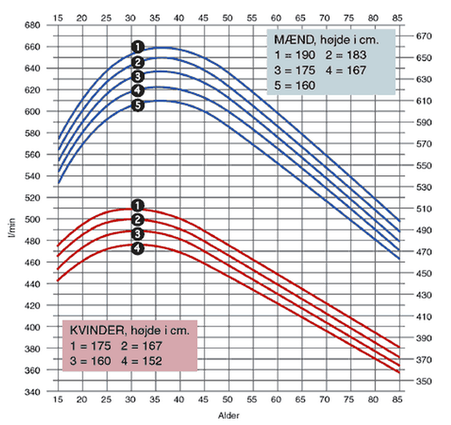

**Dato:** \_\_\_\_\_\_\_\_\_\_\_\_\_\_\_\_\_\_\_\_ &nbsp;&nbsp;&nbsp;&nbsp; **Gruppe / navne:** \_\_\_\_\_\_\_\_\_\_\_\_\_\_\_\_\_\_\_\_\_\_\_\_\_\_\_\_\_\_\_\_\_\_\_\_\_\_\_\_\_\_\_\_

## Om øvelsen

Vitalkapaciteten fortæller, hvor meget luft lungerne kan rumme, men ikke hvor let luften kan komme ud af dem. Har man astma, er bronkiegrenene forsnævrede, og så kan vitalkapaciteten godt være normal, selvom ventilationsevnen er nedsat. Ventilationsevnen måles i stedet som luftens største strømningshastighed under en kraftig udånding — **Peak Flow** — i liter pr. minut.

I skal måle jeres eget Peak Flow med et peakflow-meter, sammenligne det med den værdi, der er forventet for jeres køn, alder og højde, og til sidst samle klassens tal, så I kan sammenligne kønnene.

## Fremgangsmåde

1. Mål jeres højde uden sko, og notér den sammen med køn og alder i skemaet.
2. Sæt et nyt engangsmundstykke på peakflow-metrets rør, og skub viseren tilbage til nul i bunden af skalaen.
3. Stå oprejst, og hold apparatet vandret. Pas på ikke at dække skalaen eller blokere viseren med fingrene.
4. Tag en så dyb indånding som muligt, og luk læberne tæt om mundstykket.
5. Blæs ud så kraftigt og så hurtigt, som det overhovedet er muligt — ét kort, eksplosivt pust. Her tæller **hastigheden**, ikke hvor længe I kan blive ved.
6. Aflæs viserens position på skalaen (L/min), og notér værdien.
7. Nulstil viseren, og gentag i alt tre gange. Jeres Peak Flow er den **højeste** af de tre værdier.
8. Aflæs jeres forventede Peak Flow i @fig-diagram, og beregn afvigelsen mellem den målte og den forventede værdi (se afsnittet Registrering af målinger).
9. Tør mundstykket og apparatet af med sprit og papir efter brug.

{#fig-diagram width="70%"}

::: {.callout-tip}
## Tip

- Læberne skal slutte helt tæt om mundstykket, og tungen må ikke sidde foran hullet. Et "host" ned i apparatet giver et falsk højt udslag — det skal være et rent, kraftigt pust.
- Hold en pause på et halvt minut mellem de tre pust, så I ikke bliver svimle.
- Findes jeres præcise højde ikke som kurve i diagrammet, så aflæs mellem de to nærmeste kurver.
- Alle i klassen skal måle på **samme** peakflow-meter — forskellige apparater kan være kalibreret lidt forskelligt.
:::

::: {.callout-note}
## Materialer (pr. gruppe)

- Peakflow-meter
- Engangsmundstykker — ét pr. person
- Sprit og papir til aftørring
- Målebånd eller højdemåler
:::

::: {.callout-important}
## Sikkerhed

- Hvert mundstykke bruges kun af én person. Mundstykker må aldrig deles eller genbruges af andre.
- Tør apparatet af med sprit, inden det går videre til den næste.
- Det kraftige pust kan gøre jer svimle. Mål stående tæt ved en stol, og sæt jer, hvis I bliver utilpasse.
- Har I astma, en luftvejsinfektion eller andet, der gør det ubehageligt at puste maksimalt ud, så sig det til læreren. I kan sagtens deltage i databehandlingen uden selv at blive målt.
:::

## Registrering af målinger

**Forsøgsperson:** \_\_\_\_\_\_\_\_\_\_\_\_\_\_\_\_\_\_\_\_ &nbsp;&nbsp;&nbsp;&nbsp; **Køn (K/M):** \_\_\_\_\_\_ &nbsp;&nbsp;&nbsp;&nbsp; **Alder:** \_\_\_\_\_\_ år &nbsp;&nbsp;&nbsp;&nbsp; **Højde (uden sko):** \_\_\_\_\_\_ cm

| | Pust 1 | Pust 2 | Pust 3 | Målt (højeste) | Forventet |
|:---|:---:|:---:|:---:|:---:|:---:|
| Peak Flow (L/min) | | | | | |

: Dine egne tre pust, den højeste værdi og den forventede værdi aflæst i @fig-diagram. {#tbl-1}

Beregn, hvor mange procent din målte værdi afviger fra den forventede:

$$\text{Afvigelse (\%)} = \frac{\text{forventet} - \text{målt}}{\text{forventet}} \cdot 100$$

**Min afvigelse:** \_\_\_\_\_\_\_\_ %

Skriv derefter dit resultat ind i klassens skema sammen med de andres.

| Navn | Køn (K/M) | Alder (år) | Højde (cm) | Peak Flow (L/min) |
|:---|:---:|:---:|:---:|:---:|
| | | | | |
| | | | | |
| | | | | |
| | | | | |
| | | | | |
| | | | | |
| | | | | |
| | | | | |
| | | | | |
| | | | | |
| | | | | |
| | | | | |
| | | | | |
| | | | | |
| | | | | |
| | | | | |
| | | | | |
| | | | | |
| | | | | |
| | | | | |

: Klassens resultater. K = kvinde, M = mand. Skemaet kan overføres direkte til et regneark. {#tbl-2}

## Databehandling

1. Beregn klassens gennemsnitlige højde og gennemsnitlige Peak Flow for henholdsvis kvinder og mænd. I et regneark kan I sortere data efter køn og bruge funktionen `=MIDDEL`.
2. Aflæs i @fig-diagram, hvad der er forventet for de to gennemsnitshøjder, og sammenlign med klassens gennemsnitsværdier.
3. Beregn forskellen i Peak Flow mellem klassens mænd og kvinder i procent:

$$\text{Forskel (\%)} = \frac{\text{Peak Flow for mænd} - \text{Peak Flow for kvinder}}{\text{Peak Flow for mænd}} \cdot 100$$
