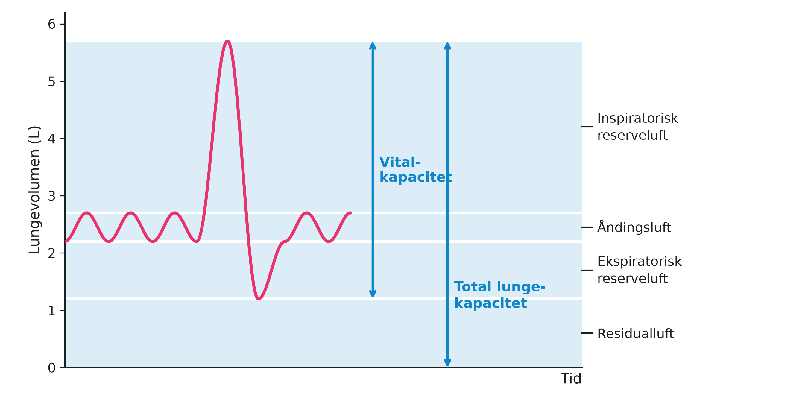

**Dato:** \_\_\_\_\_\_\_\_\_\_\_\_\_\_\_\_\_\_\_\_ &nbsp;&nbsp;&nbsp;&nbsp; **Gruppe / navne:** \_\_\_\_\_\_\_\_\_\_\_\_\_\_\_\_\_\_\_\_\_\_\_\_\_\_\_\_\_\_\_\_\_\_\_\_\_\_\_\_\_\_\_\_

## Om øvelsen

Vitalkapaciteten er den største luftmængde, man kan puste ud efter en maksimal indånding — altså den største respirationsdybde, en person kan præstere. Den måles i liter og er et udtryk for, hvor stor en luftmængde der er til rådighed i lungerne til at skaffe kroppen ny, livsvigtig (= vital) ilt. I skal måle jeres egen vitalkapacitet med et lommespirometer og samle klassens målinger, så I kan sammenligne kønnene og undersøge, om vitalkapaciteten hænger sammen med højden.

{#fig-lungevolumener width="95%"}

Hos voksne kvinder ligger vitalkapaciteten normalt mellem 3 og 5 liter, hos mænd mellem 4 og 6 liter. Store og kraftige personer har naturligt større lunger, og lungefunktionen falder med alderen, fordi brystkassen bliver mindre bevægelig og åndedrætsmuskulaturen svækkes. Lungernes størrelse er i det væsentlige arveligt bestemt, men de muskler, sener og led, der medvirker ved den kraftige ind- og udånding, kan trænes — derfor har veltrænede personer alligevel ofte en større vitalkapacitet.

Et spirometer (af latin *spirare* = ånde og *metrum* = måle) måler den luftmængde, der skiftes ud ved ind- og udånding. Lommespirometret er en lille, mekanisk udgave: man blæser i et mundstykke, og luftmængden aflæses direkte på en skala forrest på apparatet.

## Fremgangsmåde

1. Mål jeres højde uden sko, og notér den sammen med køn og alder i skemaet.
2. Sæt et nyt engangsmundstykke på lommespirometret, og stil jer op.
3. Nulstil apparatet ved at dreje på skiven, så målepilen står ud for nul på skalaen.
4. Tag et par dybe indåndinger.
5. Placér mundstykket i munden efter den sidste dybe indånding, og luk læberne tæt om det.
6. Blæs støt og kraftigt, så længe I kan, og pres så meget luft ud af lungerne som muligt. Udåndingen skal være jævn og være afsluttet i løbet af 5–6 sekunder.
7. Aflæs værdien i liter, og notér den. Nulstil apparatet, og gentag målingen i alt tre gange — I behøver ikke skifte mundstykke mellem jeres egne målinger.
8. Brug den **højeste** af de tre målinger som jeres vitalkapacitet, og skriv den i klassens skema.
9. Tør mundstykket og apparatet af med sprit og papir efter brug.

::: {.callout-tip}
## Tip

- Læberne skal slutte helt tæt om mundstykket. Slipper der luft ud ved siden af, bliver målingen for lav.
- Stå oprejst under målingen. Sidder man sammensunket, kan brystkassen ikke udvide sig frit, og resultatet bliver for lille.
- Hold en pause på et halvt minut mellem de tre målinger, så I ikke bliver svimle.
- Alle i klassen skal måle på **samme** spirometer og måle højden med samme målebånd — ellers kan tallene ikke sammenlignes.
:::

::: {.callout-note}
## Materialer (pr. gruppe)

- Lommespirometer
- Engangsmundstykker — ét pr. person
- Sprit og papir til aftørring
- Målebånd eller højdemåler
:::

::: {.callout-important}
## Sikkerhed

- Hvert mundstykke bruges kun af én person. Mundstykker må aldrig deles eller genbruges af andre.
- Tør apparatet af med sprit, inden det går videre til den næste.
- De dybe indåndinger kan gøre jer svimle. Mål stående tæt ved en stol, og sæt jer, hvis I bliver utilpasse.
- Har I astma, en luftvejsinfektion eller andet, der gør det ubehageligt at puste maksimalt ud, så sig det til læreren. I kan sagtens deltage i databehandlingen uden selv at blive målt.
:::

## Registrering af målinger

**Forsøgsperson:** \_\_\_\_\_\_\_\_\_\_\_\_\_\_\_\_\_\_\_\_ &nbsp;&nbsp;&nbsp;&nbsp; **Køn (K/M):** \_\_\_\_\_\_ &nbsp;&nbsp;&nbsp;&nbsp; **Alder:** \_\_\_\_\_\_ år &nbsp;&nbsp;&nbsp;&nbsp; **Højde (uden sko):** \_\_\_\_\_\_ cm

| | Måling 1 | Måling 2 | Måling 3 | Højeste måling |
|:---|:---:|:---:|:---:|:---:|
| Vitalkapacitet (L) | | | | |

: Dine egne tre målinger. Den højeste af dem er din vitalkapacitet. {#tbl-1}

Skriv derefter dit resultat ind i klassens skema sammen med de andres.

| Navn | Køn (K/M) | Alder (år) | Højde (cm) | Vitalkapacitet (L) |
|:---|:---:|:---:|:---:|:---:|
| | | | | |
| | | | | |
| | | | | |
| | | | | |
| | | | | |
| | | | | |
| | | | | |
| | | | | |
| | | | | |
| | | | | |
| | | | | |
| | | | | |
| | | | | |
| | | | | |
| | | | | |
| | | | | |
| | | | | |
| | | | | |
| | | | | |
| | | | | |

: Klassens data. K = kvinde, M = mand. Skemaet kan overføres direkte til et regneark, hvor graferne laves. {#tbl-2}

## Databehandling

1. Beregn klassens gennemsnitlige vitalkapacitet for henholdsvis piger og drenge.
2. Afsæt vitalkapaciteten som funktion af højden i et koordinatsystem, med piger og drenge i hver sin farve.
3. Vurdér ud fra grafen, om der i jeres data er en tilnærmelsesvis lineær sammenhæng mellem højde og vitalkapacitet.
