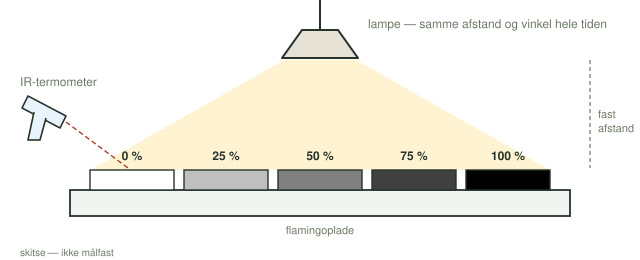

**Dato:** \_\_\_\_\_\_\_\_\_\_\_\_\_\_\_\_\_\_\_\_ &nbsp;&nbsp;&nbsp;&nbsp; **Gruppe / navne:** \_\_\_\_\_\_\_\_\_\_\_\_\_\_\_\_\_\_\_\_\_\_\_\_\_\_\_\_\_\_\_\_\_\_\_\_\_\_\_\_

## Om øvelsen

Sne og havis er hvide og kaster det meste af sollyset tilbage. Åbent hav og asfalt er mørke og optager det meste. I denne øvelse undersøger I, hvordan en overflades farve påvirker dens temperatur. Først måler I på overflader omkring skolen, bagefter laver I et kontrolleret forsøg med gråtoner under en lampe. Til sidst kobler I resultaterne til smeltende havis i Arktis.

## Baggrund

En overflades *albedo* er den andel af det indkommende lys, der bliver kastet tilbage:

$$\text{albedo} = \frac{\text{tilbagekastet stråling}}{\text{indkommende stråling}}$$

Albedo er et tal mellem 0 og 1. Frisk sne har en albedo omkring 0,8–0,9, mens åbent hav ligger omkring 0,06. Den stråling, der ikke kastes tilbage, bliver optaget og varmer overfladen op.

Et IR-termometer måler den infrarøde stråling, som en overflade udsender, og omregner den til en temperatur. Så kan man måle overfladetemperaturen uden at røre ved den.

{#fig-opstilling width="100%"}

## Hypotese

Skriv en hypotese om, hvordan farven på en overflade påvirker dens temperatur, når den bliver belyst af sol eller lampe. Hypotesen skal kunne afkræftes af jeres målinger.

::: {.callout-important}
## Sikkerhed

Lampen bliver meget varm. Rør ikke ved skærmen, og lad ikke papiret komme helt op til pæren. Peg aldrig et IR-termometer med laser mod nogens øjne.
:::

::: {.callout-note}
## Materialer (pr. gruppe)

- IR-termometer
- Papir med fem gråtonefelter: 0 %, 25 %, 50 %, 75 % og 100 %
- Flamingoplade
- Lampe med glødepære eller halogenpære
- Lineal og stopur
:::

## Fremgangsmåde

### Del 1 — målinger udenfor

1. Find mindst fem overflader med forskellig farve, fx asfalt, græs, beton, en bil og en hvid væg.
2. Mål temperaturen på hver overflade med IR-termometeret. Hold termometeret i samme afstand hver gang.
3. Skriv resultaterne i @tbl-1. Notér også, om overfladen var i sol eller skygge, og om den var våd eller tør.

### Del 2 — kontrolleret forsøg med gråtoner

1. Læg papiret med gråtoner på flamingopladen.
2. Mål starttemperaturen på alle fem felter, og skriv den i @tbl-2.
3. Stil lampen over papiret. Mål afstanden fra pæren til papiret, og hold samme afstand og vinkel resten af forsøget.
4. Tænd lampen. Mål temperaturen på alle fem felter med jævne mellemrum, fx hvert 10. sekund, til I har fem målinger. Skriv dem i @tbl-2.

## Registrering af målinger

| Overflade | Farve | Sol eller skygge? | Våd eller tør? | Temperatur (°C) |
|:---|:---|:-:|:-:|:-:|
| | | | | |
| | | | | |
| | | | | |
| | | | | |
| | | | | |

: Del 1: overflader omkring skolen. {#tbl-1}

Afstand fra pære til papir: \_\_\_\_\_\_\_\_ cm &nbsp;&nbsp;&nbsp;&nbsp; Tid mellem målingerne: \_\_\_\_\_\_\_\_ s

| Gråtone (%) | Start (°C) | M1 (°C) | M2 (°C) | M3 (°C) | M4 (°C) | M5 (°C) |
|:-:|:-:|:-:|:-:|:-:|:-:|:-:|
| 0 | | | | | | |
| 25 | | | | | | |
| 50 | | | | | | |
| 75 | | | | | | |
| 100 | | | | | | |

: Del 2: temperaturen på gråtonefelterne. {#tbl-2}

## Databehandling

1. Beregn gennemsnittet af de fem målinger M1–M5 for hvert felt:

$$\bar{T} = \frac{T_1 + T_2 + T_3 + T_4 + T_5}{5}$$

2. Beregn opvarmningen af hvert felt i forhold til starttemperaturen:

$$\Delta T = T_5 - T_\text{start}$$

| Gråtone (%) | Gennemsnit $\bar{T}$ (°C) | Opvarmning $\Delta T$ (°C) |
|:-:|:-:|:-:|
| 0 | | |
| 25 | | |
| 50 | | |
| 75 | | |
| 100 | | |

: Beregnede værdier. {#tbl-3}

3. Lav et (x,y)-punktdiagram i Excel eller Google Sheets med gråtonen i % på x-aksen og opvarmningen $\Delta T$ på y-aksen. Navngiv akserne, og skriv enhederne på.
4. Undersøg, om der er en lineær sammenhæng, og indsæt i givet fald en tendenslinje.

## Journalspørgsmål

1. Hvilken sammenhæng ser I mellem gråtone og opvarmning? Forklar den med begrebet albedo.
2. Sammenlign jeres målinger udenfor med det kontrollerede forsøg. Ser I den samme sammenhæng?
3. Hvilke faktorer kan forklare forskellene mellem forsøget ude og inde? Tænk fx på vind, skygge, solhøjde, fugt og materialets varmekapacitet.
4. Hvilke variabler var uafhængige, afhængige og kontrollerede i Del 2? Hvorfor er Del 1 ikke et kontrolleret forsøg?
5. Hvilke fejlkilder kan have spillet ind? Tænk fx på måleusikkerhed, IR-termometerets måleplet, og at forskellige materialer udsender infrarød stråling forskelligt (emissivitet).
6. Hvordan kunne forsøget forbedres?
7. Blev jeres hypotese bekræftet eller afkræftet? Begrund.
8. Forklar is-albedo-tilbagekoblingen: Hvad sker der med albedo og opvarmning, når havisen i Arktis smelter og bliver erstattet af mørkt hav — og hvorfor kaldes det en positiv tilbagekobling?
9. Smeltende havis og indlandsis giver også mere ferskvand i Nordatlanten. Hvordan kan det hænge sammen med en svækket Golfstrøm?
