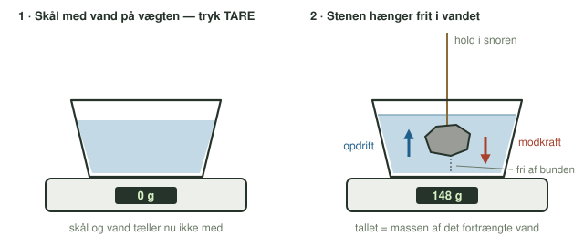
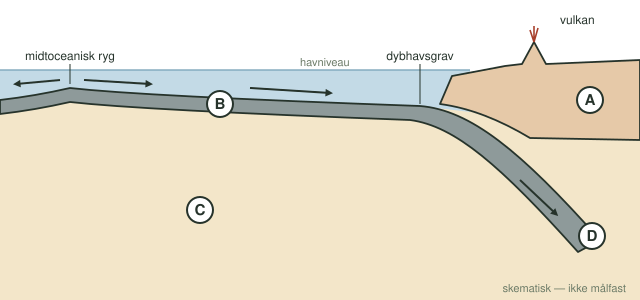

**Dato:** \_\_\_\_\_\_\_\_\_\_\_\_\_\_\_\_\_\_\_\_ &nbsp;&nbsp;&nbsp;&nbsp; **Gruppe / navne:** \_\_\_\_\_\_\_\_\_\_\_\_\_\_\_\_\_\_\_\_\_\_\_\_\_\_\_\_\_\_\_\_\_\_\_\_\_\_\_\_\_\_\_\_

## Om øvelsen

Kontinenterne har ligget på Jordens overflade i milliarder af år, men oceanbunden bliver hele tiden skabt ved de midtoceaniske rygge og forsvinder igen ned i kappen ved dybhavsgravene. Forklaringen skal findes i, hvad pladerne er lavet af. I denne øvelse bestemmer I **densiteten** af fire bjergarter, som hver repræsenterer sin del af Jorden. Bagefter bruger I tallene til at forklare, hvorfor pladerne opfører sig så forskelligt.

## Baggrund

Densitet er masse pr. rumfang:

$$\rho = \frac{m}{V}$$

Massen af en sten kan I veje direkte. Rumfanget er sværere at finde, fordi stenen har en uregelmæssig form. I løser det ved at lade vandet gøre arbejdet:

* Vandet løfter opad på en sten, der er sænket ned i det. Denne **opdrift** er lige så stor som tyngden af det vand, stenen skubber til side (Arkimedes' lov).
* Stenen skubber til gengæld lige så meget nedad på vandet. Hænger stenen frit i en snor, er det den kraft og kun den, vægten under skålen mærker. Resten af stenens tyngde bæres af snoren.
* Nulstiller I vægten med vandskålen på, viser den derfor direkte **massen af det fortrængte vand**.

Vand har densiteten 1,00 g/cm³. Hvert gram fortrængt vand svarer altså til 1 cm³, og det rumfang har stenen også.

{#fig-opstilling width="100%"}

## Hypotese

De fire bjergarter er **granit**, **basalt**, **peridotit** og **eklogit**. Prøv at løfte dem i hånden, og slå op, hvor på Jorden de hører hjemme. Skriv derefter jeres bud på rækkefølgen fra lettest til tungest, **inden** I måler.

Lettest \_\_\_\_\_\_\_\_\_\_\_\_\_\_\_\_ < \_\_\_\_\_\_\_\_\_\_\_\_\_\_\_\_ < \_\_\_\_\_\_\_\_\_\_\_\_\_\_\_\_ < \_\_\_\_\_\_\_\_\_\_\_\_\_\_\_\_ tungest

::: {.callout-note}
## Materialer (pr. gruppe)

- En præcis vægt
- Skål eller bægerglas med vand, stor nok til at den største sten kan hænge frit
- Tynd snor, fx gavebånd eller fiskeline
- Køkkenrulle
- Fire bjergartsprøver: granit (eller granitisk gnejs), basalt, peridotit og eklogit
:::

## Fremgangsmåde

1. Tør stenene af, så de er helt tørre, og vej hver af dem. Skriv massen i @tbl-1.
2. Bind snoren godt fast om den første sten.
3. Fyld vand i skålen, så stenen senere kan dækkes helt. Stil skålen på vægten, og tryk **TARE**. Vent, til vægten viser 0 g.
4. Sænk stenen ned i vandet ved at holde i snoren. Den skal være helt dækket, men må hverken røre bunden eller siderne (@fig-opstilling).
5. Ryst stenen let, så eventuelle luftbobler slipper. Aflæs vægten, når tallet står stille, og skriv det i @tbl-1 som måling 1.
6. Løft stenen op, lad den dryppe af, og gentag trin 3–5. Skriv resultatet som måling 2.
7. Gør det samme med de tre andre sten. Nulstil vægten igen før hver sten, for der er måske sprøjtet lidt vand ud.

::: {.callout-tip}
## Tip

Store sten giver de mest præcise resultater. En vægt, der viser hele gram, har en usikkerhed på ± 1 g, og det betyder meget mere for en sten på 40 g end for en på 400 g.
:::

## Registrering af målinger

| Bjergart | Stenens masse (g) | Fortrængt vand, måling 1 (g) | Fortrængt vand, måling 2 (g) |
|:---|:-:|:-:|:-:|
| Granit | | | |
| Basalt | | | |
| Peridotit | | | |
| Eklogit | | | |

: Rådata: masse af stenene og af det vand, de fortrænger. {#tbl-1}

## Databehandling

1. Beregn gennemsnittet af de to målinger af fortrængt vand for hver sten. Omregn det til stenens rumfang, hvor vandets densitet er 1,00 g/cm³:

$$V_\text{sten} = \frac{m_\text{fortrængt vand}}{\rho_\text{vand}}$$

2. Beregn densiteten af hver sten:

$$\rho_\text{sten} = \frac{m_\text{sten}}{V_\text{sten}}$$

| Bjergart | Rumfang (cm³) | Densitet (g/cm³) |
|:---|:-:|:-:|
| Granit | | |
| Basalt | | |
| Peridotit | | |
| Eklogit | | |

: Jeres gruppes beregnede rumfang og densitet. {#tbl-2}

3. Skriv jeres densiteter op på tavlen sammen med de andre gruppers, og saml hele klassens resultater i @tbl-3. Beregn gennemsnittet for hver bjergart, hvor $n$ er antallet af grupper, der har målt på den:

$$\bar{\rho} = \frac{\rho_1 + \rho_2 + \dots + \rho_n}{n}$$

| Gruppe | Granit (g/cm³) | Basalt (g/cm³) | Peridotit (g/cm³) | Eklogit (g/cm³) |
|:-:|:-:|:-:|:-:|:-:|
| 1 | | | | |
| 2 | | | | |
| 3 | | | | |
| 4 | | | | |
| 5 | | | | |
| 6 | | | | |
| 7 | | | | |
| 8 | | | | |
| **Gennemsnit** | | | | |

: Hele klassens målte densiteter. {#tbl-3}

4. Sæt de fire bjergarter i rækkefølge efter klassens gennemsnit, og sammenlign med jeres hypotese.
5. @fig-profil viser et snit fra en midtoceanisk ryg til et kontinent. Find ud af, hvilken bjergart der hører til i hvert af felterne A–D, og udfyld @tbl-4.

{#fig-profil width="88%"}

| Felt | Del af Jorden | Bjergart | Klassens gennemsnit (g/cm³) |
|:-:|:---|:---|:-:|
| A | | | |
| B | | | |
| C | | | |
| D | | | |

: Bjergarterne placeret i snittet. {#tbl-4}

## Journalspørgsmål

1. Forklar med egne ord, hvorfor vægten viser massen af det fortrængte vand og ikke stenens masse, når stenen hænger i snoren. Hvad ville vægten vise, hvis stenen lå på bunden af skålen?
2. Brug jeres målte densiteter til at forklare, hvorfor det altid er oceanbundspladen og aldrig kontinentet, der bliver presset ned i en subduktionszone.
3. Basalten omdannes til eklogit, når den oceaniske plade er nået ned i dybden. Sammenlign eklogittens densitet med kappens (peridotittens). Hvad betyder forskellen for, om pladen synker videre af sig selv, og hvilken rolle spiller det som drivkraft for pladebevægelserne?
4. De ældste bjergarter på kontinenterne er omkring 4 milliarder år gamle, mens den ældste oceanbund er under 200 millioner år gammel. Forklar forskellen ud fra jeres resultater.
5. Kontinenterne ligger over havniveau, og oceanbunden ligger flere kilometer under. Hvordan kan forskellen i densitet være med til at forklare det?
6. Vurdér jeres fejlkilder. Hvilke af dem giver for stor en densitet, og hvilke giver for lille? Tænk fx på luftbobler, en porøs sten, der suger vand, snoren og vægtens opløsning.
7. Sammenlign jeres egne densiteter med klassens gennemsnit. Hvor meget spreder gruppernes resultater, og hvorfor er et gennemsnit af hele klassen mere pålideligt end én gruppes måling?
8. Hvor godt repræsenterer én håndstor sten en hel del af Jorden? Diskutér, hvad der kunne gøre resultatet endnu mere sikkert.
