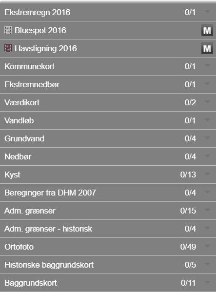
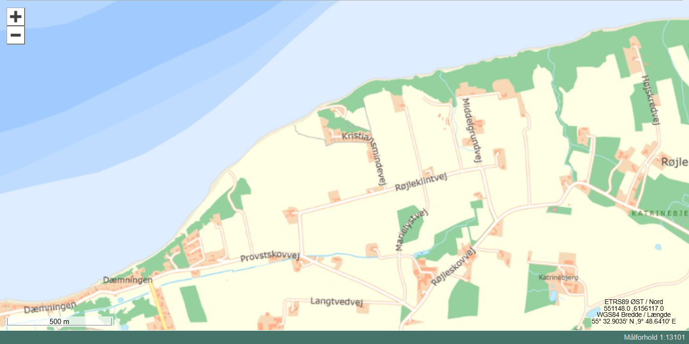
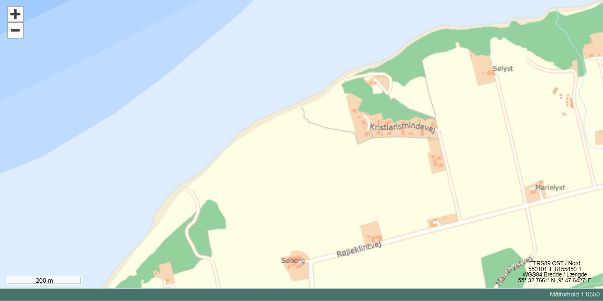
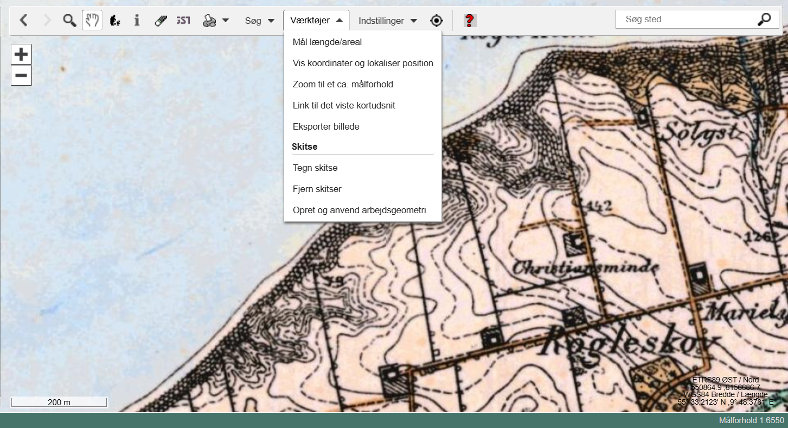
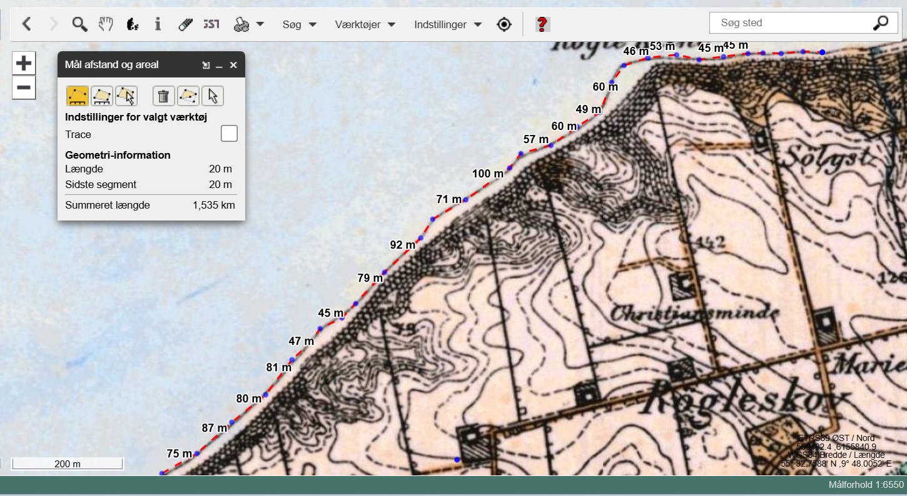
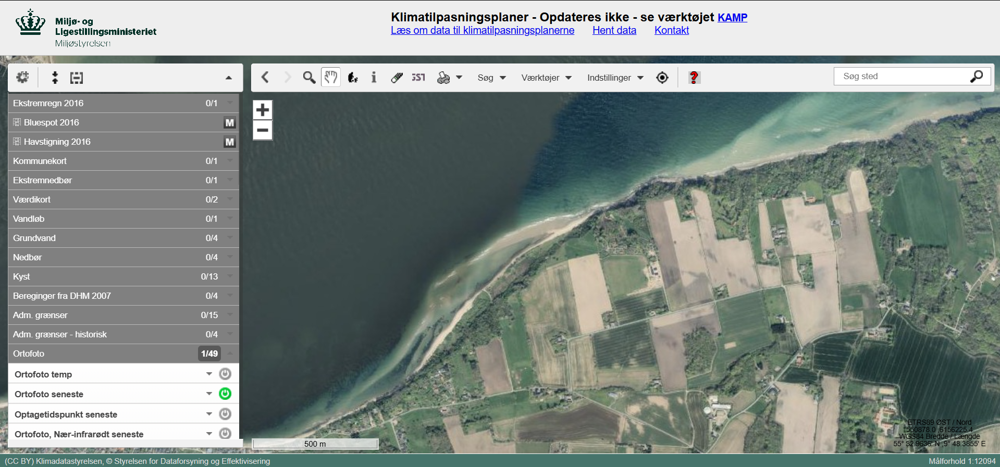
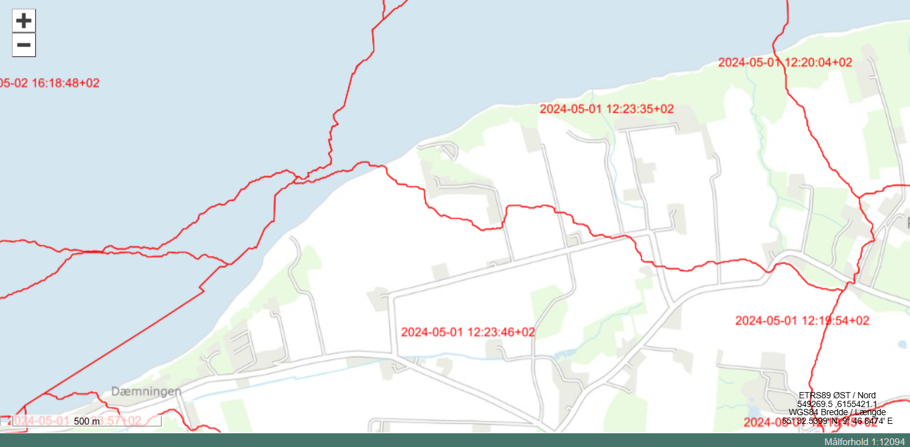
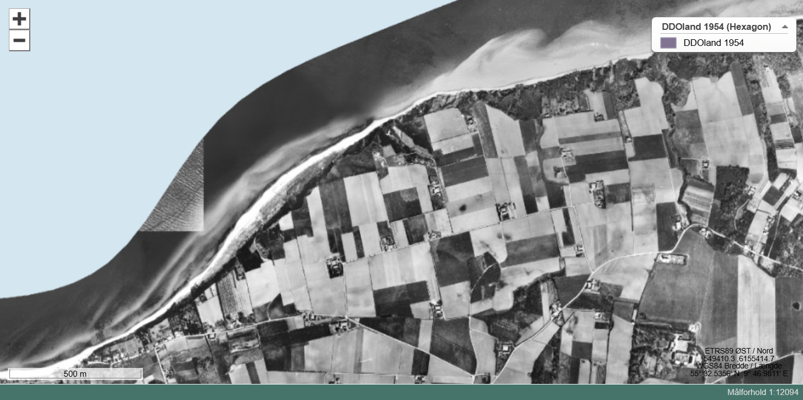
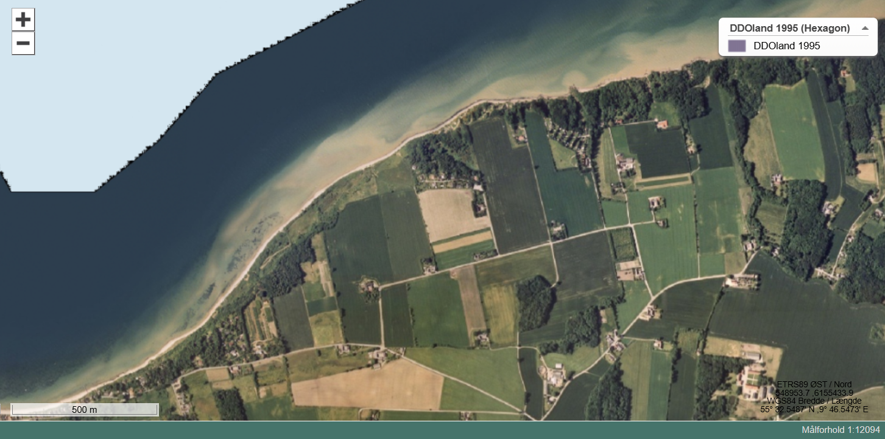

**Dato:** \_\_\_\_\_\_\_\_\_\_\_\_\_\_\_\_\_\_\_\_ &nbsp;&nbsp;&nbsp;&nbsp; **Gruppe / navne:** \_\_\_\_\_\_\_\_\_\_\_\_\_\_\_\_\_\_\_\_\_\_\_\_\_\_\_\_\_\_\_\_\_\_\_\_\_\_\_\_\_\_\_\_

## Om øvelsen

I skal undersøge, hvordan kystlinjen ved Røjle Klint har flyttet sig gennem de sidste ca. 100 år. Det gør I ved i det digitale kortværktøj MiljøGIS at optegne kystlinjen på historiske målebordsblade og ortofoto (luftfotos) fra forskellige år og sammenligne, hvor der er eroderet materiale væk, og hvor der er aflejret nyt.

::: {.callout-note}
## Adgang

- Computer med internetadgang
- MiljøGIS: <https://miljoegis.mim.dk/spatialmap?&profile=miljoegis-klimatilpasningsplaner>
:::

## Fremgangsmåde

1. Åbn MiljøGIS via linket ovenfor.
2. Orienter dig i rullemenuen i venstre side af skærmen, særligt de tre nederste (se @fig-menu).

{#fig-menu width="45%"}

3. Klik på **Baggrundskort**, og vælg **Skærmkort (DAF)**. Zoom ind på området nær Røjle Klint, til du ser noget i stil med @fig-skaermkort.

{#fig-skaermkort}

::: {.callout-tip}
## Tip

På ekskursionen parkerede vi i den nordlige ende af Kristiansmindevej og gik til stranden vest for Røjle Klint — det er også her, I skal kigge på kortet.
:::

4. Zoom endnu mere ind, til dit skærmudsnit ligner @fig-zoom.

{#fig-zoom}

5. Uden at ændre på skærmudsnittet skal du nu klikke på **Historiske baggrundskort** og vælge **Høje målebordsblade 1842-1899**. Du bør få noget, der ser ud som @fig-1899.

{#fig-1899}

6. Vælg **Værktøjer** fra menuen over kortet, og vælg **Mål længde/areal**.
7. Vælg **Mål afstand**, og tegn kystlinjen op ved at følge den med musen og klikke med jævne mellemrum, særligt når kystlinjen ændrer retning. @fig-eksempel viser et eksempel på, hvordan det kan se ud — indsæt herefter dit eget skærmprint af resultatet:

{#fig-eksempel}

*(Indsæt eget skærmprint her)*

8. **VIGTIGT!** Uden at slette kystlinjen på det gamle kort skal du nu klikke på kortlaget **Lave målebordsblade 1901-1971** i menuen til venstre (Historiske baggrundskort). Notér, hvor den gamle kystlinje afviger fra den nye: hvor er der fjernet materiale, og hvor er der tilført materiale?
9. Tegn kystlinjen op igen med samme værktøj, og indsæt et skærmprint her:

*(Indsæt eget skærmprint her)*

10. Vælg så **Ortofoto 1954 (Hexagon)**, og sammenlign med kystlinjen fra Lave målebordsblade. Hvad har ændret sig, og *hvor* er kystlinjen blevet ændret? Indtegn den nye kystlinje, tag et skærmprint, og indsæt det her:

*(Indsæt eget skærmprint her)*

11. Vælg til sidst **Ortofoto seneste**, og sammenlign med kystlinjen for Ortofoto 1954. Hvilke ændringer kan du få øje på, og hvor? Indtegn den nye kystlinje, og indsæt et skærmprint her:

*(Indsæt eget skærmprint her)*

## Ekstraopgaver

1. Find Røjle Klint på det sammenstykkede foto af Danmark, **Ortofoto 1/49**, ved at klikke på **seneste** (se @fig-danmark).

{#fig-danmark}

2. Klik på **"Optagetidspunkt seneste"** (se @fig-optagetidspunkt).

{#fig-optagetidspunkt}

3. Hvornår er billederne taget?
4. Hvilken dato har vi i dag?
5. Klik på det ældste ortofoto, **DDOland 1954 (Hexagon)**, og se på skærmprintet i @fig-1954.

{#fig-1954}

6. Klik på det næstældste ortofoto, **DDOland 1995 (Hexagon)**, og se på skærmprintet i @fig-1995.

{#fig-1995}

7. Hvad er der sket med stranden vest for Røjle Klint fra 1954 til 1995? (Og hvad er der sket med størrelsen på markerne?)
