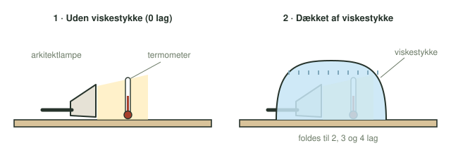

**Dato:** \_\_\_\_\_\_\_\_\_\_\_\_\_\_\_\_\_\_\_\_ &nbsp;&nbsp;&nbsp;&nbsp; **Gruppe / navne:** \_\_\_\_\_\_\_\_\_\_\_\_\_\_\_\_\_\_\_\_\_\_\_\_\_\_\_\_\_\_\_\_\_\_\_\_\_\_\_\_

## Om øvelsen

Jordens overflade opvarmes af solen og afgiver selv varme. Drivhusgasser som CO₂ og vanddamp holder på en del af den varme, så Jorden er langt varmere, end den ellers ville være. I denne øvelse laver I en lille model af drivhuseffekten: en lampe varmer et termometer op, og I lægger et, to, tre og fire lag viskestykke over. Spørgsmålet er, hvor meget temperaturen stiger for hvert ekstra lag, og om der opstår en ny ligevægt hver gang.

## Baggrund

Når lampen er tændt, tilføres der hele tiden energi. Termometeret og luften omkring det bliver varmere, indtil de afgiver lige så meget energi, som de får tilført. Så holder temperaturen op med at stige. Det kaldes en *dynamisk ligevægt*: der sker hele tiden noget, men temperaturen er konstant.

Viskestykket gør det sværere for varmen at slippe væk. Så skal temperaturen højere op, før der igen går lige så meget energi ud, som der kommer ind.

{#fig-opstilling width="100%"}

## Hypotese

Formulér en kort hypotese om, hvad der sker med temperaturen ved ligevægt, når antallet af lag viskestykke stiger. Hypotesen skal kunne afkræftes af jeres målinger.

::: {.callout-important}
## Sikkerhed

Pæren og lampeskærmen bliver meget varme. Lad ikke viskestykket røre selve pæren, og sluk lampen, hvis det lugter brændt. Brug en LED-pære, hvis I ikke har en almindelig pære — men så bliver opvarmningen meget mindre.
:::

::: {.callout-note}
## Materialer (pr. gruppe)

- Arkitektlampe med en 60 W-pære
- Termometer, gerne digitalt
- Viskestykker, nok til 4 lag
- Ur eller stopur
:::

## Fremgangsmåde

1. Læg lampen ned på bordet, så pæren peger vandret hen over bordet.
2. Læg termometeret, så det måler temperaturen lige foran pæren. Termometeret må ikke flyttes i resten af forsøget.
3. Aflæs temperaturen, før lampen tændes, og skriv den i @tbl-1 som starttemperatur.
4. Tænd lampen. Aflæs temperaturen, når den er konstant, dvs. når den ikke er steget i et minut. Skriv den i @tbl-1 ud for 0 lag.
5. Dæk både lampe og termometer med ét lag viskestykke. Aflæs igen, når temperaturen er konstant.
6. Fold viskestykket, så det ligger dobbelt, og gentag.
7. Gentag med 3 og 4 lag viskestykke.

::: {.callout-tip}
## Tip

Skriv også ned, hvor lang tid der gik, før temperaturen blev konstant. Det fortæller noget om, hvor hurtigt systemet finder sin nye ligevægt.
:::

## Registrering af målinger

Starttemperatur, før lampen tændes: \_\_\_\_\_\_\_\_\_\_ °C

| Lag viskestykke | Temperatur ved ligevægt (°C) | Tid, før temperaturen blev konstant (min) |
|:-:|:-:|:-:|
| 0 | | |
| 1 | | |
| 2 | | |
| 3 | | |
| 4 | | |

: Rådata: temperaturen ved ligevægt for hvert antal lag. {#tbl-1}

## Databehandling

1. Beregn temperaturstigningen i forhold til 0 lag:

$$\Delta T_n = T_n - T_0$$

   hvor $T_n$ er temperaturen ved ligevægt med $n$ lag.

2. Beregn, hvor meget temperaturen steg fra hvert lag til det næste:

$$\Delta T_{n-1 \to n} = T_n - T_{n-1}$$

| Lag viskestykke $n$ | $\Delta T_n$ i forhold til 0 lag (°C) | Stigning fra laget før (°C) |
|:-:|:-:|:-:|
| 0 | 0 | — |
| 1 | | |
| 2 | | |
| 3 | | |
| 4 | | |

: Beregnede værdier. {#tbl-2}

3. Lav et (x,y)-punktdiagram i Excel eller Google Sheets med antal lag på x-aksen og temperaturen ved ligevægt på y-aksen. Navngiv akserne, og skriv enhederne på.
4. Undersøg, om der er en lineær sammenhæng. Indsæt i givet fald en tendenslinje, og aflæs hældningen — den fortæller, hvor mange grader temperaturen stiger pr. lag.

## Journalspørgsmål

1. Forklar, hvad lampen, termometeret og viskestykkerne hver især svarer til i den virkelige drivhuseffekt.
2. Forklar med begrebet dynamisk ligevægt, hvorfor temperaturen holder op med at stige, selvom lampen stadig er tændt.
3. Var sammenhængen mellem antal lag og temperatur lineær? Hvad ville det betyde for klimaet, hvis hver ekstra mængde CO₂ gav lige meget ekstra opvarmning — og hvad hvis effekten blev mindre og mindre?
4. Find en figur, der viser drivhuseffekten med energistrømme, og forklar de enkelte processer: indstråling, refleksion, udstråling fra jorden og tilbagestråling fra atmosfæren.
5. Hvor høj ville Jordens gennemsnitstemperatur være, hvis der ikke var nogen drivhuseffekt? Sammenlign med den faktiske gennemsnitstemperatur.
6. Find en figur, der viser, hvordan Jordens gennemsnitstemperatur har udviklet sig, siden man begyndte at måle den, og beskriv udviklingen.
7. Viskestykket holder især på varmen ved at stoppe den varme luft i at stige op og blive erstattet af kold luft. Drivhusgasser virker ved at absorbere og udsende infrarød stråling. Diskutér, hvor godt modellen viser den rigtige mekanisme.
8. Er forsøget kvantitativt eller kvalitativt? Er det et kontrolleret forsøg — hvilke variabler holdt I konstant? Er det repeterbart? Svar med begrundelser, ikke bare ja eller nej.
9. Blev jeres hypotese bekræftet eller afkræftet? Begrund ud fra jeres graf.
