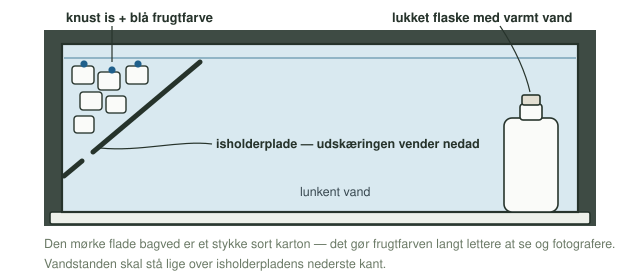
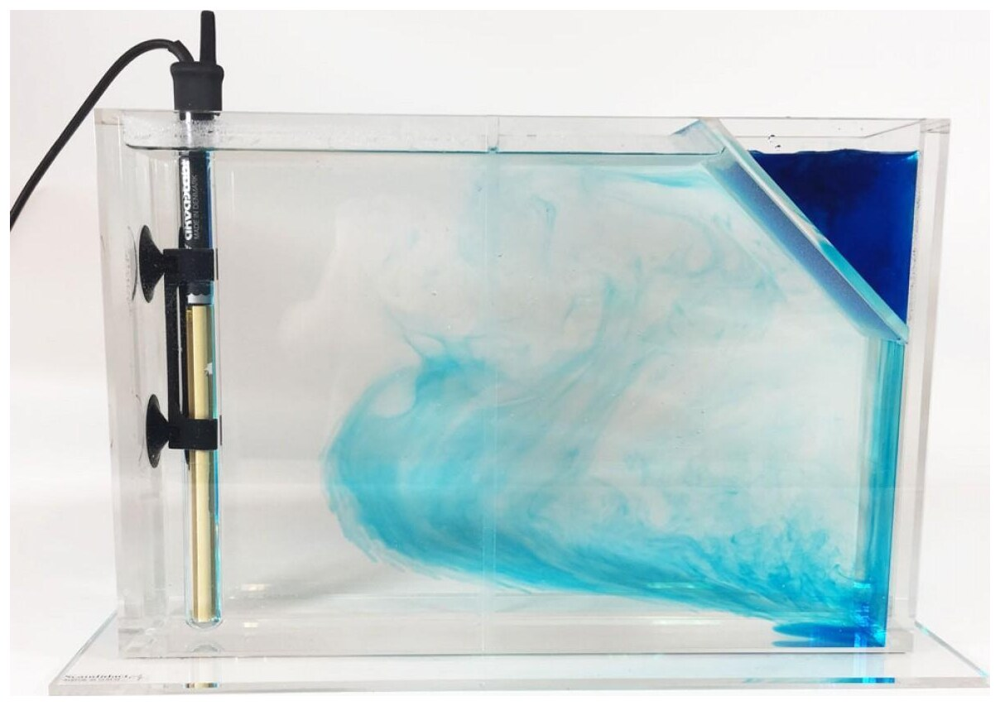

**Dato:** \_\_\_\_\_\_\_\_\_\_\_\_\_\_\_\_\_\_\_\_ &nbsp;&nbsp;&nbsp;&nbsp; **Gruppe / navne:** \_\_\_\_\_\_\_\_\_\_\_\_\_\_\_\_\_\_\_\_\_\_\_\_\_\_\_\_\_\_\_\_\_\_\_\_\_\_\_\_\_\_\_\_

## Om øvelsen

Danmark ligger nordligere end det meste af Labrador, Canada og er alligevel langt varmere om vinteren. Forklaringen er havstrømmen **Golfstrømmen** og dens forlængelse mod nordøst, som fører varmt overfladevand nordpå mod Nordvesteuropa. Strømmen skyldes for det meste vinden og Jordens rotation, men den bliver forstærket af **Grønlandspumpen**: ude for Grønland har vandet afgivet sin varme til luften, så det er blevet koldt og tungt og synker til bunds — og det trækker nyt, varmt overfladevand nordpå i stedet.

I denne øvelse bygger I en model af pumpen i ét gennemsigtigt kar med is i den ene ende og en varmekilde i den anden. Farven viser jer, hvor vandet bevæger sig hen — men hvor løber det, og hvad sker der i den varme ende? Det skal I selv observere og konkludere ud fra forsøget.

## Baggrund

Vandets **densitet** (massefylde) er massen pr. rumfang:

$$\rho = \frac{m}{V}$$

Koldt vand er tungere (mere tætpakket) end varmt vand — det er hele modellens drivkraft. I det virkelige hav spiller saltholdigheden også ind, fordi salt vand er tungere end fersk vand:

{#fig-densitet width="92%"}

I dette forsøg bruger I kun temperaturforskellen — is i den ene ende, varmt vand i den anden.



Når havis dannes i virkeligheden, bygges saltionerne ikke ind i iskrystallerne, men efterlades i vandet under isen, som derfor bliver ekstra tungt:

{#fig-havis width="100%"}

Det tunge vand, der dannes ved Grønland, synker helt til bunds og løber sydpå som **nordatlantisk dybvand**. Når noget synker, skal noget andet rykke ind i stedet — og det er Golfstrømmen og dens forlængelse, der fører varmt overfladevand nordpå igen:

{#fig-pumpen width="100%"}

## Opstillingen

{#fig-opstilling width="100%"}

## Hypotese

Skriv jeres bud, **inden** I går i gang, og begrund med densitet.

Tegn med pile ind på @fig-opstilling, hvor I tror det blå vand løber hen, når is og varmekilde begge er sat i gang — og hvad der så må ske henne ved den varme ende.

\_\_\_\_\_\_\_\_\_\_\_\_\_\_\_\_\_\_\_\_\_\_\_\_\_\_\_\_\_\_\_\_\_\_\_\_\_\_\_\_\_\_\_\_\_\_\_\_\_\_\_\_\_\_\_\_\_\_\_\_\_\_\_\_\_\_\_\_\_\_\_\_\_\_\_\_\_\_\_\_\_\_\_\_\_\_\_\_\_\_\_\_\_\_\_\_

::: {.callout-important}
## Sikkerhed

Vandet i flasken må godt være kogende — pas blot på ikke at skolde jer, når flasken fyldes og håndteres, og brug grydelapper eller lignende, hvis den er meget varm at røre ved. Karret er af plexiglas, men er stadig skrøbeligt ved kanterne: stil det ind på bordet, ikke ud mod kanten. Tør spildt vand op med det samme, både på bordet og på gulvet.
:::

::: {.callout-note}
## Materialer (pr. gruppe)

- Gennemsigtigt plexiglas-kar
- Isholderplade (med udskæring, der skal vende nedad)
- Knust is
- Flaske med skruelåg til varmt vand
- Blå frugtfarve
- Lunkent vand
- Sort karton til baggrund
- Stopur og tommestok/lineal
- Mobil til billeder
:::

## Fremgangsmåde

1. Fyld karret med lunkent vand, til vandet står lige over isholderpladens nederste kant.
2. Sæt isholderpladen i den ene ende, så **udskæringen vender nedad** — se @fig-opstilling. Det er gennem den, det afkølede vand slipper ud langs bunden.
3. Læg et lag knust is på pladen.
4. Dryp et par dråber blå frugtfarve **ned på isen** — ikke ned i karret. Farven skal følge smeltevandet og det afkølede vand, ikke lægge sig et tilfældigt sted.
5. Stil en lukket flaske med varmt vand i den modsatte ende som varmekilde.
6. Stil sort karton bag karret, og lad være med at røre ved bordet i tre minutter. Start stopuret, når farven begynder at løbe.
7. Observér, hvad der sker med det blå, afkølede vand, både ved bunden og ved overfladen. Notér i @tbl-1.
8. **Tag tid:** notér, hvor lang tid der går, fra farven begynder at løbe ud under pladen, til fronten når den modsatte ende af karret. Mål samtidig karrets indvendige længde med en lineal.
9. Fotografér både opstillingen og resultatet, og tegn det, I så, oven i jeres pile på @fig-opstilling — brug en anden farve end gættet.

{#fig-foto width="88%"}

Karrets indvendige længde: \_\_\_\_\_\_\_\_\_\_\_ cm

## Registrering af målinger

| Det forventede vi | Det så vi | Tid (s) |
|:---|:---|:---:|
| | | |

: Iagttagelser fra forsøget. Tiden er den tid, bundstrømmen er om at nå den modsatte ende. {#tbl-1}

## Databehandling

**1. Bundstrømmens fart.** Beregn farten af det blå vand langs bunden:

$$v = \frac{s}{t}$$

hvor $s$ er karrets indvendige længde, og $t$ er den tid, I målte i @tbl-1. Angiv resultatet i cm/s.

**2. Sammenlign med det virkelige hav.** Det nordatlantiske dybvand løber sydpå med omkring 2–10 cm/s — men over en strækning, der er mange millioner gange længere end jeres kar. Sammenlign med jeres egen måling, og vurdér, om det giver mening at sammenligne farten direkte.

## Journalspørgsmål

1. Forklar med begreberne densitet og temperatur, hvorfor det afkølede vand synker ved isen og bevæger sig langs bunden, mens der samtidig strømmer vand tilbage ved overfladen.
2. Hvorfor er det nødvendigt, at isholderpladens udskæring vender nedad? Hvad tror I ville ske, hvis pladen vendte omvendt?
3. Nævn mindst to måder, modellen er en forsimpling af den virkelige Grønlandspumpe på (tænk på saltholdighed, vind og Jordens rotation).
4. Hvad tror I ville ske, hvis I brugte koldt saltvand i stedet for bare is og koldt ferskvand ved den kolde ende? Ville cirkulationen blive kraftigere eller svagere — og hvorfor?
5. Hvad kan der ske med denne cirkulation, hvis der tilføres store mængder smeltevand fra Grønlands indlandsis? Begrund svaret med, at smeltevand er fersk og derfor let.
6. Diskutér metoden: hvad kunne have gjort det svært at bestemme, præcis hvornår farvefronten nåede den modsatte ende?
