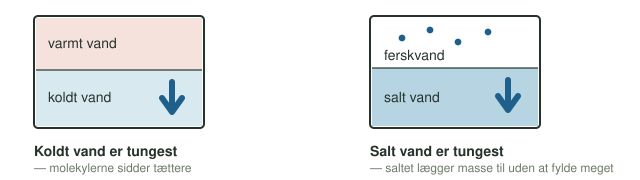
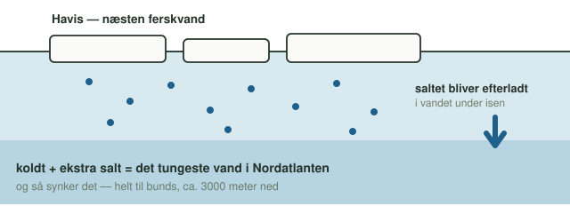
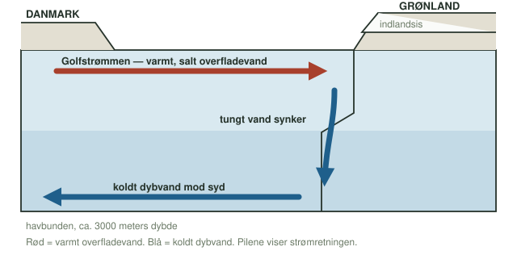
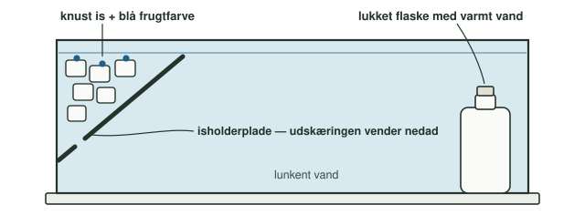

**Dato:** \_\_\_\_\_\_\_\_\_\_\_\_\_\_\_\_\_\_\_\_ &nbsp;&nbsp;&nbsp;&nbsp; **Gruppe / navne:** \_\_\_\_\_\_\_\_\_\_\_\_\_\_\_\_\_\_\_\_\_\_\_\_\_\_\_\_\_\_\_\_\_\_\_\_\_\_\_\_

## Om øvelsen

Danmark ligger på samme breddegrad som Labrador i Canada, men har langt mildere vintre. En vigtig del af forklaringen er Golfstrømmen og dens forlængelse, som fører varmt overfladevand op mod Nordvesteuropa. Strømmen drives mest af vinden og Jordens rotation, men den forstærkes af Grønlandspumpen: ude ved Grønland afgiver havvandet sin varme til luften, bliver koldt og tungt og synker til bunds. Så trækkes der nyt, varmt overfladevand nordpå.

I denne øvelse undersøger I først, hvad temperatur og saltindhold hver for sig betyder for vandets bevægelse. Derefter bygger I hele pumpen i ét kar med is i den ene ende og varme i den anden. Til sidst skal I bruge resultaterne til at forklare, hvordan klimaforandringer i Arktis kan svække strømmen.

## Baggrund

Vandets densitet er massen pr. rumfang:

$$\rho = \frac{m}{V}$$

Koldt vand har højere densitet end varmt vand, og salt vand har højere densitet end ferskvand:

{#fig-densitet width="92%"}

Når havis dannes, bygges saltet ikke ind i isen. Det efterlades i vandet under isen, som derfor bliver ekstra tungt:

{#fig-havis width="100%"}

Det tunge vand synker til bunds og løber sydpå som nordatlantisk dybvand. Når noget synker, må noget andet strømme ind i stedet. Det er Golfstrømmen og dens forlængelse, der fører varmt overfladevand nordpå igen. Hele kredsløbet kaldes den termohaline cirkulation — *termo* for temperatur og *halin* for salt.

{#fig-pumpen width="100%"}

## Hypotese

Skriv jeres bud, inden I går i gang, og begrund dem med densitet.

1. Hvad sker der, når koldt vand møder varmt vand?
2. Hvad sker der, når ferskvand møder saltvand?
3. Hvordan kan der opstå en cirkulation i karret, når is og varme bruges på samme tid? Tegn med pile på @fig-opstilling, hvor I tror, vandet vil løbe.

::: {.callout-important}
## Sikkerhed

Vandet i flasken må gerne være meget varmt. Pas på ikke at skolde jer, når flasken fyldes, og brug grydelapper, hvis den er for varm at holde på. Karret er skrøbeligt ved kanterne, så stil det ind på bordet, ikke ud mod kanten. Tør spildt vand op med det samme.
:::

::: {.callout-note}
## Materialer (pr. gruppe)

- Plexiglas-kar med skilleplade
- Isholderplade (med en lille udskæring, der skal vende nedad)
- Knust is
- Blue cap-flaske med varmt vand
- Frugtfarve, blå og rød
- Salt og en teske
- Lunkent og koldt vand
- Stopur og lineal
- Mobil til billeder
:::

## Fremgangsmåde

### Del 1 — koldt og varmt vand

1. Sæt skillepladen i midten af karret.
2. Fyld varmt vand i den ene side og koldt vand i den anden, lige højt.
3. Kom blå farve i den kolde side.
4. Træk skillepladen forsigtigt lige op, og observér. Notér i @tbl-1.

### Del 2 — saltvand og ferskvand

1. Tøm karret, sæt skillepladen i igen, og fyld begge sider med lunkent vand.
2. Rør et par teskefulde salt og lidt rød farve ud i den ene side. Det er havsiden. Den anden side er ferskvand.
3. Træk skillepladen forsigtigt op, og observér. Notér i @tbl-1.

### Del 3 — hele pumpen

1. Tøm karret, og tag skillepladen helt ud.
2. Sæt isholderpladen i den ene ende, så udskæringen vender nedad (@fig-opstilling).
3. Fyld karret med lunkent vand, til vandet står lige over isholderpladens nederste kant.
4. Læg knust is på pladen, og dryp lidt blå farve ned på isen — ikke ned i karret.
5. Stil flasken med varmt vand i den modsatte ende som varmekilde.
6. Observér, hvad der sker med det blå vand, både ved bunden og ved overfladen. Tegn det, I ser, oven i jeres pile på @fig-opstilling med en anden farve.
7. Mål med linealen, hvor langt der er langs bunden fra isholderpladen til flasken. Tag tid på, hvor længe det blå vand er om at nå den strækning. Skriv begge dele i @tbl-2.
8. Tag billeder af opstillingen og af resultatet.

{#fig-opstilling width="100%"}

## Registrering af målinger

| Delforsøg | Hvad så I? (kvalitativ observation) |
|:--------------------|:------------------------------------------------------------|
| Del 1: koldt og varmt vand |     |
| Del 2: saltvand og ferskvand |     |
| Del 3: hele pumpen |     |

: Observationer fra de tre delforsøg. {#tbl-1}

| Strækning langs bunden $s$ (cm) | Tid $t$ (s) |
|:-:|:-:|
| | |

: Rådata: det blå vands vej langs bunden i Del 3. {#tbl-2}

## Databehandling

1. Beregn bundstrømmens fart i karret:

$$v = \frac{s}{t}$$

2. Den nordatlantiske dybvandsstrøm bevæger sig typisk nogle få centimeter i sekundet. Sammenlign med jeres resultat.

## Journalspørgsmål

1. Forklar med begreberne densitet og temperatur, hvorfor det kolde vand synker ved isen, og hvorfor det varme vand stiger ved flasken.
2. Sammenlign Del 1 og Del 2. Hvad var mest effektivt til at få vandet til at bevæge sig: temperaturforskellen eller saltforskellen?
3. Hvordan minder cirkulationen i karret om dybvandsdannelsen ved Grønland? Nævn mindst to måder, modellen er en forenkling af virkeligheden på.
4. Hvordan kan smeltevand fra indlandsisen og mindre havis ændre cirkulationen i virkeligheden? Brug både temperatur og salt i svaret.
5. Hvad kan en svækket Golfstrøm betyde for klimaet i Danmark og Nordeuropa?
6. Stemte jeres hypoteser med resultaterne?
7. Hvilke af jeres observationer var kvalitative, og hvilke var kvantitative? Hvilke variabler holdt I konstant, og hvilke ændrede I?
8. Kunne andre gentage forsøget og få samme resultat? Hvad kunne have påvirket jeres resultater (fejlkilder)?
