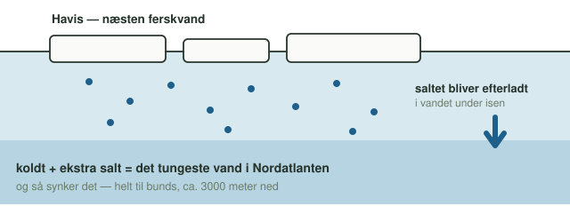
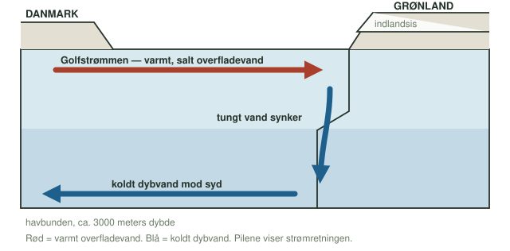
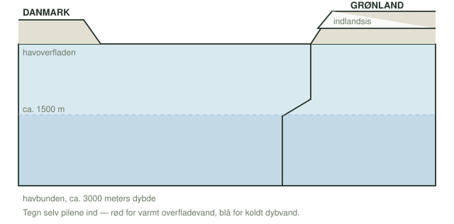

**Dato:** \_\_\_\_\_\_\_\_\_\_\_\_\_\_\_\_\_\_\_\_ &nbsp;&nbsp;&nbsp;&nbsp; **Gruppe / navne:** \_\_\_\_\_\_\_\_\_\_\_\_\_\_\_\_\_\_\_\_\_\_\_\_\_\_\_\_\_\_\_\_\_\_\_\_\_\_\_\_\_\_\_\_

## Om øvelsen

Danmark ligger nordligere end det meste af Labrador og er alligevel langt varmere om vinteren. Forklaringen er, at Nordatlanten fungerer som et varmeanlæg: varmt overfladevand føres nordpå, afgiver sin varme til luften over Nordvesteuropa, bliver tungt og synker til bunds ud for Grønland. Den cirkulation kaldes **den termohaline cirkulation** — af *termo* (temperatur) og *halin* (saltindhold) — og den nordatlantiske del af den kaldes i daglig tale **Grønlandspumpen**.

I denne øvelse bygger I en model af pumpen i et gennemsigtigt kar og måler den fysiske størrelse, der driver den: **densiteten**. Øvelsen er delt i fire:

1. **Del 1 — temperaturforskellen alene.** Hvad sker der, når koldt og varmt vand mødes?
2. **Del 2 — saltforskellen alene.** Hvad sker der, når salt og fersk vand mødes?
3. **Del 3 — hele pumpen.** Is i den ene ende, varme i den anden — og en cirkulation, I kan se.
4. **Del 4 — densiteten målt.** Hvor meget tungere er saltvand egentlig end ferskvand?

Del 1–3 er kvalitative: I beskriver og tegner, hvad I ser. Del 4 er kvantitativ og giver tallene til databehandlingen.

## Baggrund

### Densitet

**Densitet** (massefylde) er massen pr. rumfang:

$$\rho = \frac{m}{V}$$

hvor $\rho$ måles i g/cm³ eller kg/m³ ($1\ \text{g/cm}^3 = 1000\ \text{kg/m}^3$). To vandmasser med forskellig densitet blander sig ikke uden videre: den tungeste lægger sig nederst, og den letteste flyder ovenpå. Det er hele forsøgets princip.

For havvand afhænger densiteten af to ting, og de trækker hver sin vej:

{#fig-densitet width="92%"}

Postevand ved 20 °C har densiteten ca. 0,998 g/cm³. Havvand med gennemsnitligt saltindhold har ved samme temperatur ca. 1,025 g/cm³ — altså knap 3 % tungere.

### Saltholdighed

Havvandets **saltholdighed** (salinitet) angives i promille, ‰, altså gram salt pr. kilogram havvand:

$$S = \frac{m_{\text{salt}}}{m_{\text{opløsning}}}\cdot 1000\ \text{‰}$$

Verdenshavets gennemsnit er ca. 35 ‰ — omtrent 35 gram salt pr. liter vand. I praksis blander I i denne øvelse saltvand efter gram pr. liter, hvilket ligger tæt nok på promille til, at I kan sammenligne direkte.

### Havisen efterlader saltet

Det ene punkt, man ikke kan gætte sig til, er hvad der sker, når havis dannes. Når havvand fryser, bygges saltionerne ikke ind i iskrystallerne — de bliver efterladt i vandet under isen. Havis er derfor næsten ferskvand, mens vandet lige under isen bliver **saltere** end det omgivende hav:

{#fig-havis width="100%"}

### Pumpen

Det tunge vand synker ud for Grønlands kyst helt til bunds, omkring 3000 meter ned, og løber derfra sydpå langs havbunden som **nordatlantisk dybvand**. Når noget synker, skal noget andet rykke ind i stedet — og det er Golfstrømmen og dens forlængelse, Den Nordatlantiske Strøm, der fører varmt overfladevand nordpå. Pumpen holder sig selv i gang, så længe der bliver dannet tungt vand deroppe.

{#fig-pumpen width="100%"}

## Opstillingen

{#fig-opstilling width="100%"}

## Hypotese

Skriv jeres bud, **inden** I går i gang, og begrund hver gang med densitet.

Hvad tror I sker, når koldt vand møder varmt vand (Del 1)?

\_\_\_\_\_\_\_\_\_\_\_\_\_\_\_\_\_\_\_\_\_\_\_\_\_\_\_\_\_\_\_\_\_\_\_\_\_\_\_\_\_\_\_\_\_\_\_\_\_\_\_\_\_\_\_\_\_\_\_\_\_\_\_\_\_\_\_\_\_\_\_\_\_\_\_\_\_\_\_\_\_\_\_\_\_\_\_\_\_\_\_\_\_\_\_\_

Hvad tror I sker, når ferskvand møder saltvand (Del 2)?

\_\_\_\_\_\_\_\_\_\_\_\_\_\_\_\_\_\_\_\_\_\_\_\_\_\_\_\_\_\_\_\_\_\_\_\_\_\_\_\_\_\_\_\_\_\_\_\_\_\_\_\_\_\_\_\_\_\_\_\_\_\_\_\_\_\_\_\_\_\_\_\_\_\_\_\_\_\_\_\_\_\_\_\_\_\_\_\_\_\_\_\_\_\_\_\_

Tegn med pile ind på @fig-opstilling, hvor I tror det blå vand løber hen i Del 3 — og hvad der så må ske henne ved den varme ende.

Hvor meget tungere tror I, saltvand er end postevand (Del 4)? Skriv et tal i g/cm³:

\_\_\_\_\_\_\_\_\_\_\_\_\_\_\_\_\_\_\_\_\_\_\_\_\_\_\_\_\_\_\_\_\_\_\_\_\_\_\_\_

::: {.callout-important}
## Sikkerhed

Vandet i flasken i Del 3 må godt være kogende — pas blot på ikke at skolde jer, når flasken fyldes og håndteres, og brug grydelapper eller lignende, hvis den er meget varm at røre ved. Cylinderglas og måleglas er af glas: stil dem ind på bordet, ikke ud mod kanten. Tør spildt vand op med det samme, både på bordet og på gulvet.
:::

::: {.callout-note}
## Materialer (pr. gruppe)

- Gennemsigtigt plexiglas-kar med skilleplade
- Isholderplade (med udskæring, der skal vende nedad)
- Knust is
- Flaske med skruelåg til varmt vand
- Frugtfarve, blå og rød
- Salt (almindeligt bordsalt) og en skål til afvejning
- Lunkent vand og koldt vand
- Vægt med 0,1 g opløsning eller finere
- Måleglas, 100 mL (2 stk., eller ét der kan tørres mellem målingerne)
- Målebæger eller måleglas på 500–1000 mL til at blande saltvand i
- Sort karton til baggrund
- Stopur og tommestok/lineal
- Mobil til billeder
:::

## Fremgangsmåde

### Del 1 — temperaturforskellen alene

**Formål:** at se, hvad en temperaturforskel alene gør ved to vandmasser.

1. Sæt skillepladen midt i karret, og kontrollér, at den slutter tæt.
2. Fyld varmt vand i den ene side og koldt vand i den anden, til samme vandstand i begge sider. Der må ikke være salt i nogen af siderne.
3. Tilsæt blå frugtfarve til den kolde side, så I kan følge den. Rør forsigtigt.
4. Stil sort karton bag karret, og lad vandet falde helt til ro.
5. Træk skillepladen lodret op — roligt og i én bevægelse. Start stopuret.
6. Observér grænsezonen. Notér i @tbl-1, hvad I ser, og hvor lang tid der går, før vandet igen står stille.

{#fig-skilleplade width="100%"}

### Del 2 — saltforskellen alene

**Formål:** at se, hvad en saltforskel alene gør — uden temperaturforskel.

1. Skyl karret, sæt skillepladen i igen, og fyld begge sider med **lunkent vand af samme temperatur**. Det er afgørende: ellers blander I temperatur- og saltforskellen sammen og kan ikke afgøre, hvad der drev bevægelsen.
2. Opløs salt i den ene side ("havsiden"), så saltholdigheden svarer til havvand — ca. 35 gram pr. liter vand i den side. Rør, til saltet er helt opløst.
3. Tilsæt rød frugtfarve til havsiden. Kystsiden er almindeligt fersk, lunkent vand.
4. Lad vandet falde til ro, træk skillepladen op, og start stopuret.
5. Observér, og notér i @tbl-1. Sammenlign med Del 1: ser det ens ud, og går det lige hurtigt?

### Del 3 — hele pumpen

**Formål:** at få begge drivkræfter til at arbejde sammen i én synlig cirkulation.

1. Tag skillepladen helt ud, skyl karret, og fyld det med lunkent vand, til vandet står lige over isholderpladens nederste kant.
2. Sæt isholderpladen i den ene ende, så **udskæringen vender nedad** — se @fig-opstilling. Det er gennem den, det afkølede vand slipper ud langs bunden.
3. Læg et lag knust is på pladen.
4. Dryp et par dråber blå frugtfarve **ned på isen** — ikke ned i karret. Farven skal følge smeltevandet og det afkølede vand, ikke lægge sig et tilfældigt sted.
5. Stil en lukket flaske med varmt vand i den modsatte ende som varmekilde.
6. Stil sort karton bag karret, og lad være med at røre ved bordet i tre minutter. Start stopuret, når farven begynder at løbe.
7. Observér: det kolde, blå vand synker ned ved isen, løber langs bunden mod den varme ende og stiger op dér. Ved overfladen løber vand den modsatte vej tilbage mod isen — cirkulationen er sluttet.
8. **Tag tid:** notér, hvor lang tid der går, fra farven begynder at løbe ud under pladen, til fronten når den modsatte ende af karret. Mål samtidig karrets indvendige længde med en lineal.
9. Fotografér både opstillingen og resultatet, og tegn det, I så, oven i jeres pile på @fig-opstilling — brug en anden farve end gættet.

{#fig-foto width="88%"}

Karrets indvendige længde: \_\_\_\_\_\_\_\_\_\_\_ cm

### Del 4 — densiteten målt

**Formål:** at sætte tal på den forskel, I lige har set virke. Denne del kan laves sideløbende, mens karret falder til ro.

1. Vej et tomt, tørt måleglas (100 mL), og notér massen i @tbl-2.
2. Afmål præcis 100 mL postevand. Aflæs i øjenhøjde og ved meniskens **nederste** rand. Vej måleglasset med vandet, og notér.
3. Tøm og tør måleglasset, eller brug et andet af samme slags.
4. Bland saltvand med havvandskoncentration: afvej 35,0 g salt, og opløs det i vand op til 1 liter i alt. Rør, til opløsningen er helt klar.
5. Afmål 100 mL af saltvandet på samme måde, og vej.
6. **Klassens fælles måling:** læreren fordeler saltholdighederne 10, 20 og 50 g/L mellem grupperne. Bland jeres tildelte koncentration på samme måde som i punkt 4, mål densiteten, og skriv resultatet på tavlen, så klassen samlet får en måleserie til @tbl-4.

::: {.callout-tip}
## Tip

Vandets temperatur betyder også noget for densiteten, så brug vand fra samme hane og ved samme temperatur til alle vejninger — ellers måler I to ting på én gang. Skyl og tør måleglasset mellem hver væske: en rest saltvand i bunden trækker alle jeres tal i samme forkerte retning.
:::

## Registrering af målinger

| Delforsøg | Det forventede vi | Det så vi | Tid (s) |
|:---|:---|:---|:---:|
| Del 1 — koldt møder varmt | | | |
| Del 2 — salt møder fersk | | | |
| Del 3 — cirkulationen | | | |

: Iagttagelser fra delforsøgene. Tiden i Del 3 er den tid, bundstrømmen er om at nå den modsatte ende. {#tbl-1}

| | Postevand | Saltvand, 35 g/L | Klassens ekstra: \_\_\_ g/L |
|:---|:---:|:---:|:---:|
| Masse af tomt måleglas (g) | | | |
| Masse af måleglas + 100 mL væske (g) | | | |
| Væskens masse (g) | | | |

: Vejninger til bestemmelse af densitet, Del 4. {#tbl-2}

## Databehandling

**1. Væskens masse.** Beregn for hver prøve i @tbl-2 væskens masse som massen af måleglas med væske minus massen af det tomme måleglas, og skriv tallet i nederste række.

**2. Densiteten.** Beregn densiteten af hver væske. Rumfanget er de 100 mL, altså 100 cm³:

$$\rho = \frac{m}{V}$$

Angiv resultatet med tre decimaler i g/cm³, og omregn til kg/m³ ved at gange med 1000.

| | Postevand | Saltvand, 35 g/L | Klassens ekstra: \_\_\_ g/L |
|:---|:---:|:---:|:---:|
| Densitet (g/cm³) | | | |
| Densitet (kg/m³) | | | |

: Beregnet densitet af væskerne. {#tbl-3}

**3. Hvor tæt kom I på?** Sammenlign jeres to hovedmålinger med litteraturværdierne 0,998 g/cm³ for postevand og 1,025 g/cm³ for havvand ved 20 °C. Beregn den relative afvigelse:

$$\text{afvigelse} = \frac{\left|\rho_{\text{målt}} - \rho_{\text{tabel}}\right|}{\rho_{\text{tabel}}}\cdot 100\ \%$$

**4. Forskellen.** Beregn, hvor meget tungere saltvandet er end postevandet — både som en absolut forskel $\Delta\rho = \rho_{\text{salt}} - \rho_{\text{fersk}}$ og i procent af ferskvandets densitet. Sammenhold med jeres gæt i hypotesen.

**5. Densiteten som funktion af saltholdigheden.** Saml klassens målinger i skemaet, og beregn gennemsnittet for hver saltholdighed:

| Saltholdighed (g/L) | 0 | 10 | 20 | 35 | 50 |
|:---|:-:|:-:|:-:|:-:|:-:|
| Gruppe 1 — densitet (g/cm³) | | | | | |
| Gruppe 2 | | | | | |
| Gruppe 3 | | | | | |
| Gruppe 4 | | | | | |
| Gruppe 5 | | | | | |
| **Gennemsnit** | | | | | |

: Klassens densitetsmålinger ved fem saltholdigheder. {#tbl-4}

Afsæt gennemsnittene i et koordinatsystem med saltholdigheden på $x$-aksen og densiteten på $y$-aksen. Lad **ikke** $y$-aksen begynde i nul — så forsvinder hele forskellen. Tegn den bedste rette linje gennem punkterne, og bestem dens hældning ud fra to punkter på linjen:

$$a = \frac{\rho_2 - \rho_1}{S_2 - S_1}$$

Hældningen fortæller, hvor meget densiteten stiger pr. gram salt pr. liter. Brug linjen til at forudsige densiteten ved 34,9 ‰ — den saltholdighed, der faktisk måles i Grønlandshavet om vinteren.

**6. Bundstrømmens fart.** Beregn i Del 3 farten af det blå vand langs bunden:

$$v = \frac{s}{t}$$

hvor $s$ er karrets indvendige længde, og $t$ er den tid, I målte. Angiv resultatet i cm/s. Til sammenligning løber det nordatlantiske dybvand sydpå med omkring 2–10 cm/s — men over en strækning, der er mange millioner gange længere end jeres kar.

**7. Rangordn de virkelige vandmasser.** Nedenfor står fire vandmasser fra Nordatlanten med deres målte temperatur, saltholdighed og densitet. Nummerér dem i højre kolonne, 1 = tungest og 4 = letteste.

| Vandmasse | Temperatur | Saltholdighed | Densitet (kg/m³) | Nr. |
|:---|---:|---:|---:|:---:|
| Golfstrømmen ved overfladen | 12 °C | 35,5 ‰ | 1026,9 | \_\_\_ |
| Grønlandshavet om vinteren | −1 °C | 34,9 ‰ | 1028,1 | \_\_\_ |
| Dybvand, 3000 m nede | 2 °C | 34,9 ‰ | 1027,9 | \_\_\_ |
| Smeltevand fra indlandsisen | 1 °C | 0 ‰ | 1000,0 | \_\_\_ |

: Fire vandmasser fra Nordatlanten. Densiteterne er beregnet ved overfladetryk, så tallene kan sammenlignes direkte. {#tbl-5}

**8. Saml op.** Sammenhold @tbl-1 med @tbl-3 og @tbl-5: forklar med tallene i hånden, hvorfor bevægelserne i Del 1, 2 og 3 gik den vej, de gjorde.

## Journalspørgsmål

1. Forklar med fagbegreberne densitet, temperatur og salinitet, hvorfor det kolde vand synker ved isen i Del 3, og hvorfor vandet stiger igen ved den varme flaske.
2. Forklar, hvorfor havis gør vandet under isen tungere, end kulden alene ville gøre det. Hvorfor kan jeres model ikke vise den effekt?
3. Tegn Grønlandspumpen ind på tværsnittet herunder: en rød pil hvor det varme vand løber nordpå ved overfladen, en blå pil hvor det tunge vand synker ved Grønland, og en blå pil hvor dybvandet løber sydpå langs bunden. Sæt derefter et kryds dér, hvor der sker det samme som i jeres kar.

{#fig-tvaersnit width="100%"}

4. Nævn mindst tre måder, modellen er en forsimpling af det virkelige hav på — tænk på størrelse, tidsskala, vandets saltindhold, varmekilden, vinden og Jordens rotation. Vurdér for hver af dem, om forsimplingen ændrer selve mekanismen eller kun skalaen.
5. Golfstrømmen har faktisk det højeste saltindhold af de tre havvandsmasser i @tbl-5 og er alligevel den letteste. Forklar hvorfor, og brug det til at forklare, hvad ordet *termohalin* dækker over.
6. Diskutér fejlkilderne i densitetsmålingen: aflæsning af de 100 mL, vandets temperatur, vægtens opløsning og eventuelle rester i måleglasset. Hvilken af dem betyder mest, når forskellen mellem de to væsker kun er ca. 0,025 g/cm³? Kan jeres afvigelse fra litteraturværdien forklares af dem?
7. Brug densiteten af smeltevand i @tbl-5, sammenholdt med jeres egen målte densitet af saltvand, til at forklare, hvad der sker med dybvandsdannelsen, hvis Grønlands indlandsis smelter hurtigere og tilfører Nordatlanten store mængder ferskvand.
8. Klimanormalerne 1991–2020 giver København (55,7° N) en middeltemperatur i januar på +1,4 °C, mens Happy Valley-Goose Bay i Labrador (53,3° N) ligger på −17 °C — og København ligger endda længst mod nord. Om sommeren er de to byer næsten ens. Forklar forskellen ud fra den termohaline cirkulation og havstrømmenes globale energitransport.
9. Vurdér, hvad en varig svækkelse af Grønlandspumpen kan betyde for klimaet i Danmark og Nordvesteuropa. Inddrag både temperatur og nedbør, og overvej, hvorfor en svækkelse ikke er det samme som en ny istid.
10. Diskutér metoden: hvilke variable holdt I konstant, og hvilke ændrede I mellem delforsøgene? Holdt jeres hypoteser? Kunne en anden gruppe gentage forsøget og få samme resultat?
