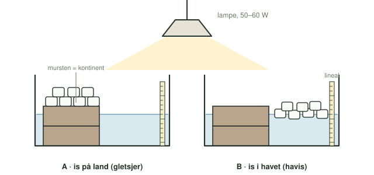

**Dato:** \_\_\_\_\_\_\_\_\_\_\_\_\_\_\_\_\_\_\_\_ &nbsp;&nbsp;&nbsp;&nbsp; **Gruppe / navne:** \_\_\_\_\_\_\_\_\_\_\_\_\_\_\_\_\_\_\_\_\_\_\_\_\_\_\_\_\_\_\_\_\_\_\_\_\_\_\_\_

## Om øvelsen

Når klimaet bliver varmere, smelter isen både på land og i havet. På land ligger gletsjere og de store indlandsiser på Grønland og Antarktis. I havet flyder havisen omkring Nordpolen og rundt om Antarktis. I denne øvelse bygger I to enkle modeller af Jorden med ét hav og ét kontinent i hver. I den ene ligger isen på land, i den anden flyder den på havet. Så lader I en lampe smelte isen og måler, hvad der sker med vandstanden.

## Baggrund

Vand findes i tre tilstandsformer: fast form (is), flydende form (vand) og gasform (vanddamp). Is har lavere densitet end flydende vand, og derfor flyder is. Densiteten er massen pr. rumfang:

$$\rho = \frac{m}{V}$$

En isterning, der flyder, fortrænger noget af vandet omkring sig. En isterning, der ligger på land, fortrænger ikke noget hav.

{#fig-opstilling width="100%"}

## Hypotese

Skriv jeres bud, inden I tænder lampen, og begrund dem.

1. Smelter isen lige hurtigt i kar A og kar B?
2. Hvad sker der med vandstanden i kar A, når isen er smeltet? Og i kar B?

::: {.callout-important}
## Sikkerhed

Lampen bliver meget varm. Rør ikke ved skærmen, mens den er tændt, og hold ledningen væk fra vandet. Tør spildt vand op med det samme.
:::

::: {.callout-note}
## Materialer (pr. gruppe)

- 2 ens gennemsigtige kar
- 4 mursten, så der kan stå 2 i hvert kar
- Isterninger, ca. 2 × 10 stk.
- Vandkande eller bægerglas med vand på 20–30 °C
- 2 linealer eller en mini-tommestok
- Lampe med glødepære, halogenpære eller terrariepære på 50–60 W (eller sollys)
- Vægt og et lille bæger til at veje isen i
- Termometer
:::

## Fremgangsmåde

1. Find alt udstyret frem, og fyld vandkanden med vand på 20–30 °C. Tag isterningerne ud af fryseren som det sidste.
2. Stil 2 mursten ved siden af hinanden i hvert kar. De er jeres kontinent.
3. Mål karrets indre længde og bredde i cm, og skriv dem i @tbl-1.
4. Vej to lige store portioner isterninger, og skriv massen i @tbl-1.
5. Læg isen i karrene:
   - I kar A lægger I isterningerne oven på murstenene. Det er jeres gletsjer.
   - I kar B lægger I isterningerne i bunden ved siden af murstenene. Det er jeres havis.
6. Hæld vand i kar A, så der er godt med vand, men isen stadig ligger tørt på murstenene.
7. Hæld vand i kar B til samme niveau som i kar A. Isen i kar B skal flyde og må ikke hvile på bunden.
8. Sæt en lineal lodret op ad væggen i hvert kar. Aflæs vandstanden i mm, og skriv den i @tbl-1 sammen med klokkeslættet.
9. Sæt lampen over de to kar, så den lyser lige meget på begge. Den forestiller en varmere atmosfære.
10. Hold øje med isen. Når al is i et kar er smeltet, så skriv klokkeslættet og aflæs vandstanden igen.

::: {.callout-tip}
## Tip

Aflæs vandstanden med øjnene i samme højde som vandoverfladen, og aflæs i bunden af den lille bue, vandet laver op ad linealen. Sæt evt. en stribe tape på karret ud for startniveauet, så selv en lille ændring kan ses.
:::

## Registrering af målinger

| | Kar A (gletsjer) | Kar B (havis) |
|:---|:-:|:-:|
| Karrets indre længde (cm) | | |
| Karrets indre bredde (cm) | | |
| Isens masse (g) | | |
| Klokkeslæt ved start | | |
| Vandstand ved start (mm) | | |
| Klokkeslæt, når al is er smeltet | | |
| Vandstand, når al is er smeltet (mm) | | |

: Rådata fra de to kar. {#tbl-1}

## Databehandling

1. Beregn vandstandsstigningen i hvert kar:

$$\Delta h = h_\text{slut} - h_\text{start}$$

2. Beregn, hvor lang tid isen var om at smelte i hvert kar.

3. Beregn, hvor meget vandstanden *burde* stige i kar A, hvis alt smeltevandet løber ud i havet. Smeltevandets rumfang er $V = m / \rho_\text{vand}$, hvor $\rho_\text{vand} = 1{,}00\ \text{g/cm}^3$. Karrets areal er $A = \text{længde} \cdot \text{bredde}$. Den forventede stigning er da:

$$\Delta h_\text{forventet} = \frac{V}{A} = \frac{m}{\rho_\text{vand} \cdot A}$$

   Husk, at svaret kommer ud i cm. Gang med 10 for at få mm. Murstenene fylder også noget af karrets areal — træk deres areal fra, hvis I vil være mere præcise.

| | Kar A (gletsjer) | Kar B (havis) |
|:---|:-:|:-:|
| Tid, til al is er smeltet (min) | | |
| Målt vandstandsstigning $\Delta h$ (mm) | | |
| Forventet stigning, hvis alt smeltevandet løber i havet (mm) | | — |

: Beregnede værdier. {#tbl-2}

4. Sammenlign den målte og den forventede stigning i kar A, og sammenlign kar A med kar B.

## Journalspørgsmål

1. Forklar ud fra densitet og fortrængning, hvorfor vandstanden ændrer sig forskelligt i kar A og kar B. Brug jeres tal fra @tbl-2.
2. Smeltede isen lige hurtigt i de to kar? Giv et bud på, hvorfor eller hvorfor ikke.
3. Hvor på Jorden finder man områder, der svarer til model A, og hvor finder man områder, der svarer til model B?
4. Vurdér, hvor godt jeres model repræsenterer virkeligheden. Tænk fx på, at havvand er salt, at havet er meget større end kontinenterne, og at havet selv udvider sig, når det bliver varmere.
5. Vurdér jeres fejlkilder: aflæsning af linealen, fordampning under lampen, og om isen i kar B rørte bunden.
6. Jeres forsøg viser formentlig, at det især er is på land, der hæver havniveauet. Betyder det, at havisen er ligegyldig for klimaet? Inddrag begrebet albedo i jeres svar.
7. Ved hvilke temperaturer skifter vand tilstandsform ved havoverfladen? Hvad ændrer sig, hvis man er på toppen af Mount Everest, hvor lufttrykket er lavere?
8. Hvilke tilstandsformer og hvilke overgange mellem dem er vigtigst, når man taler om havniveaustigninger? Begrund jeres svar.
9. Forklar med eksempler fra forsøget, hvordan en ændring i én del af klimasystemet (fx kryosfæren) kan påvirke andre dele (hydrosfæren, atmosfæren, mennesker ved kysten).
10. Hvis Golfstrømmen bremser kraftigt op, regner forskere med, at havniveauet omkring Nordatlanten kan stige en halv til en hel meter ekstra. Hvad ville det betyde for en lavtliggende dansk havneby som Middelfart?
