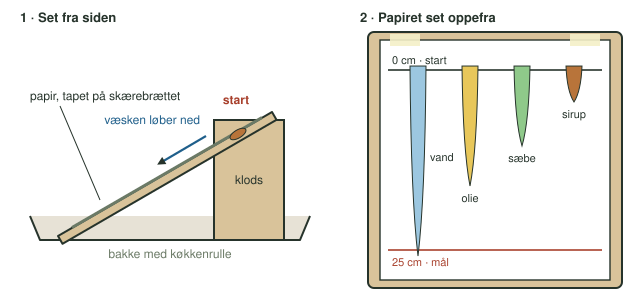
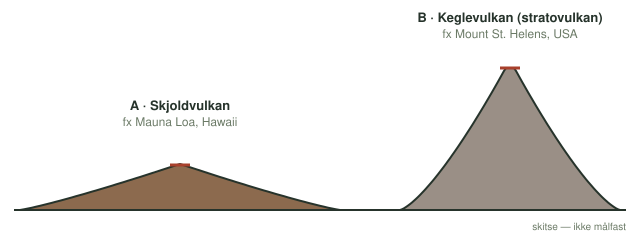

**Dato:** \_\_\_\_\_\_\_\_\_\_\_\_\_\_\_\_\_\_\_\_ &nbsp;&nbsp;&nbsp;&nbsp; **Gruppe / navne:** \_\_\_\_\_\_\_\_\_\_\_\_\_\_\_\_\_\_\_\_\_\_\_\_\_\_\_\_\_\_\_\_\_\_\_\_\_\_\_\_

## Om øvelsen

Lava er smeltet sten, der bryder ud fra en vulkan. Nogle vulkaner udbryder lava, der er meget tyndtflydende og kan strømme over store afstande. Andre udbryder lava, der er sej og næsten ikke flyder. I denne øvelse lader I fire væsker løbe ned ad en skrå plade og måler, hvor hurtigt de flyder. Bagefter bruger I resultaterne til at forklare, hvorfor vulkaner har så forskellige former.

## Baggrund

En væskes sejhed kaldes dens viskositet. Jo større viskositet en væske har, jo mere tyktflydende er den, og jo langsommere flyder den ned ad en skråning. Vand har en lille viskositet, sirup en stor.

Lava er en væske ligesom dem, I undersøger. Når den flyder ud af vulkanen, køler den af og størkner til sidst til fast sten. Hvor langt den når, inden den størkner, afhænger blandt andet af dens viskositet.

## Hypotese

Sæt de fire væsker i rækkefølge fra den mest tyndtflydende til den mest tyktflydende, inden I måler. Begrund kort jeres bud.

Mest tyndtflydende \_\_\_\_\_\_\_\_\_\_\_\_\_\_\_\_ < \_\_\_\_\_\_\_\_\_\_\_\_\_\_\_\_ < \_\_\_\_\_\_\_\_\_\_\_\_\_\_\_\_ < \_\_\_\_\_\_\_\_\_\_\_\_\_\_\_\_ mest tyktflydende

::: {.callout-note}
## Materialer (pr. gruppe)

- Skærebræt eller bageplade
- Træklods eller andet til at støtte brættet, så det står skråt
- Papir, tape, lineal og blyant
- Fire væsker med forskellig viskositet: vand, madolie, opvaskemiddel og sirup eller honning
- En spiseske eller et måleske-sæt, så I bruger samme mængde hver gang
- Bakke og køkkenrulle til at samle væsken op
- Stopur, fx i mobiltelefonen
:::

## Fremgangsmåde

1. Tegn med linealen en vandret streg øverst på papiret, og skriv 0 cm ved den. Det er startlinjen.
2. Mål 25 cm ned fra startlinjen, og tegn endnu en vandret streg. Skriv 25 cm ved den. Det er målstregen.
3. Tape papiret fast på skærebrættet. Stil brættet skråt op ad klodsen med den nederste ende i bakken (@fig-opstilling). Brættet skal have samme hældning i hele forsøget.
4. Kom en skefuld af den første væske på startlinjen, og start stopuret i samme øjeblik.
5. Stop uret, når væskens forreste kant når målstregen. Skriv tiden i @tbl-1.
6. Gentag trin 4–5, så I har tre målinger for hver væske. Brug et nyt stykke papir, eller hold sporene adskilt, så væskerne ikke løber i hinandens spor.
7. Gør det samme med de tre andre væsker.

{#fig-opstilling width="100%"}

::: {.callout-tip}
## Tip

Sirup og honning kan være meget længe om at nå målstregen. Når en væske ikke er nået frem efter 5 minutter, så stop uret og mål, hvor langt den er nået. Skriv både tiden og afstanden i @tbl-1.
:::

## Registrering af målinger

| Væske | Tid, måling 1 (s) | Tid, måling 2 (s) | Tid, måling 3 (s) | Afstand, hvis ikke 25 cm (cm) |
|:---|:-:|:-:|:-:|:-:|
| Vand | | | | |
| Olie | | | | |
| Opvaskemiddel | | | | |
| Sirup / honning | | | | |

: Rådata: tiden for at løbe fra startlinjen til målstregen. {#tbl-1}

## Databehandling

1. Beregn gennemsnittet $\bar{t}$ af de tre tider for hver væske.

2. Beregn væskens gennemsnitlige fart ned ad brættet, hvor $s$ er den afstand, væsken har løbet (normalt 25 cm):

$$v = \frac{s}{\bar{t}}$$

3. Beregn, hvor mange gange langsommere hver væske er end vand:

$$\text{gange langsommere end vand} = \frac{v_\text{vand}}{v_\text{væske}}$$

| Væske | Gennemsnitstid $\bar{t}$ (s) | Fart $v$ (cm/s) | Gange langsommere end vand | Placering (1 = mest tyndtflydende) |
|:---|:-:|:-:|:-:|:-:|
| Vand | | | 1 | |
| Olie | | | | |
| Opvaskemiddel | | | | |
| Sirup / honning | | | | |

: Beregnede værdier og væskernes rækkefølge. {#tbl-2}

4. Tegn et søjlediagram med de fire væsker på x-aksen og farten i cm/s på y-aksen.
5. Sammenlign jeres rækkefølge i @tbl-2 med jeres hypotese.

## Journalspørgsmål

{#fig-vulkaner width="100%"}

1. Hvilken af væskerne havde den største viskositet, og hvilken havde den mindste? Passede det med jeres hypotese?
2. @fig-vulkaner viser to vulkantyper. Var den lava, der byggede hver af dem op, tyndtflydende eller tyktflydende? Brug jeres resultater til at forklare, hvordan lavaens viskositet bestemmer vulkanens form.
3. Magma indeholder gasser, der slipper ud, når magmaet når op mod overfladen. Vil en tyktflydende eller en tyndtflydende lava give et eksplosivt udbrud, og hvilken vil give et roligt udbrud? Forklar hvorfor. Tænk på, hvor let det er at puste bobler gennem vand og gennem sirup med et sugerør.
4. Lavas viskositet afhænger især af dens temperatur og af, hvor meget kisel (SiO₂) den indeholder. Undersøg, hvilken lavatype der er tyndtflydende, og hvilken der er sej. Ved hvilke pladegrænser, eller hvilke andre steder, finder man typisk skjoldvulkaner, og hvor finder man keglevulkaner?
5. Hvad tror I, der ville ske med jeres resultater, hvis sirupen blev varmet op først? Hvad betyder det for lava, at den afkøles, mens den flyder ned ad vulkanen?
6. Vurdér jeres fejlkilder. Tænk fx på, om I brugte præcis samme mængde hver gang, hvornår I startede og stoppede uret, om papiret sugede noget af væsken, og om brættet havde samme hældning hele tiden.
7. Diskutér, hvor godt forsøget er som model af rigtig lava. Hvad ligner, og hvad er forskelligt?
