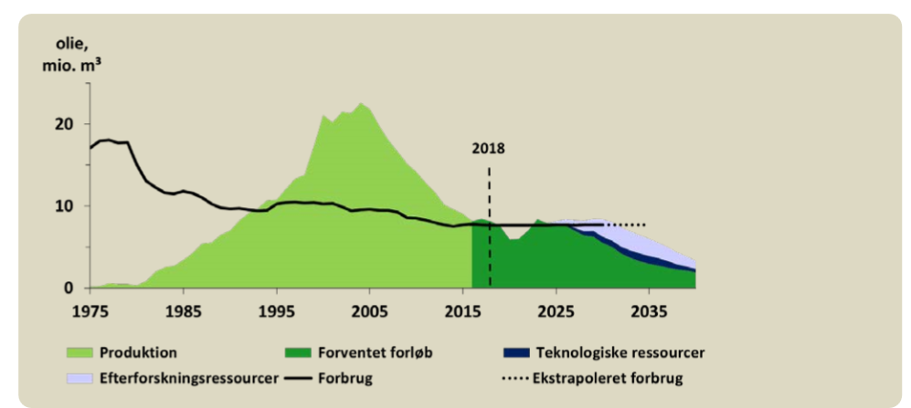
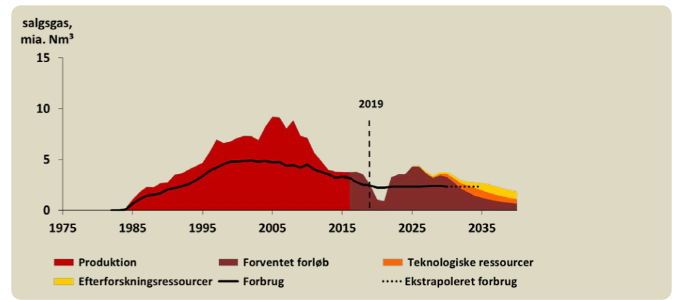
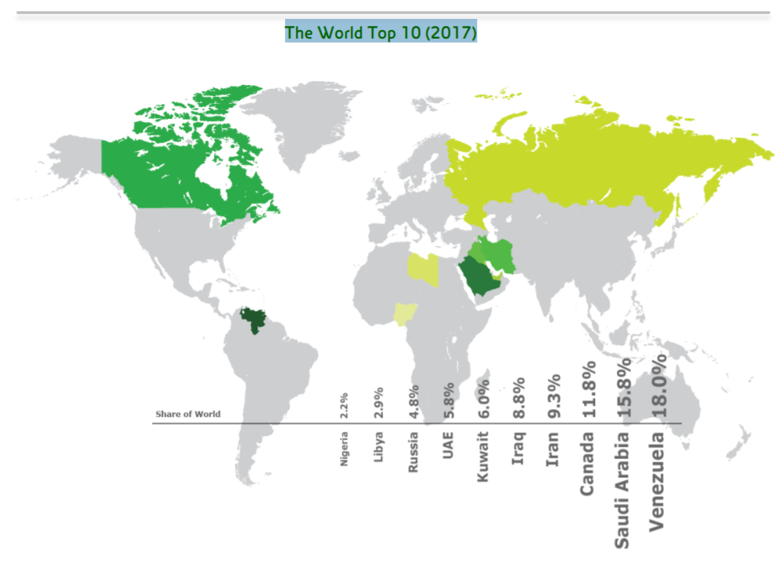

**Dato:** \_\_\_\_\_\_\_\_\_\_\_\_\_\_\_\_\_\_\_\_ &nbsp;&nbsp;&nbsp;&nbsp; **Gruppe / navne:** \_\_\_\_\_\_\_\_\_\_\_\_\_\_\_\_\_\_\_\_\_\_\_\_\_\_\_\_\_\_\_\_\_\_\_\_\_\_\_\_\_\_\_\_

## Om øvelsen

Øvelsen er delt i tre:

1. **Olie-geologi** — hvilke bjergarter hører til hvor i undergrunden?
2. **Det praktiske forsøg** — oliens migration op gennem sand.
3. **Perspektivering** — olieforbrug, -produktion og -forekomster.

## Del 1: Olie-geologi

Ved oliens dannelse og migration er der forskellige bjergarter, der lægger sig forskellige steder i forhold til hinanden. Se på bjergartsstykkerne, de løse sedimenter og råolieprøven på bordet, og sammenhold dem med billederne herunder.

{#fig-bjergarter width="100%"}

Placér nu prøverne i skemaet, så stratigrafien passer i forhold til oliedannelse og oliefælder. Øverste række er havbunden, og så går det nedad i undergrunden. Skriv bjergartens navn og billedets nummer, og begrund hver placering.

| Lag | Bjergart + billede nr. | Begrundelse i forhold til oliedannelse og oliefælde |
|:-----:|:-------------------------|:--------------------------------------------------|
| Hav | | |
| 1 | | |
| 2 | | |
| 3 | | |
| 4 | | |
| 5 | | |
| 6 | | |

: Stratigrafien fra havbunden og nedefter. Alle otte prøver skal med — to af dem kan godt høre til i samme lag. {#tbl-1}

## Del 2: Praktisk øvelse — oliens migration

**Formål:** at opnå viden om oliens migration og at knytte den til densitet.

**Hypotese:** Hvad forventer I vil ske, og hvorfor? Skriv det ned, **inden** I går i gang.

\_\_\_\_\_\_\_\_\_\_\_\_\_\_\_\_\_\_\_\_\_\_\_\_\_\_\_\_\_\_\_\_\_\_\_\_\_\_\_\_\_\_\_\_\_\_\_\_\_\_\_\_\_\_\_\_\_\_\_\_\_\_\_\_\_\_\_\_\_\_\_\_\_\_\_\_\_\_\_\_\_\_\_\_\_\_\_\_\_\_\_\_\_\_\_\_

\_\_\_\_\_\_\_\_\_\_\_\_\_\_\_\_\_\_\_\_\_\_\_\_\_\_\_\_\_\_\_\_\_\_\_\_\_\_\_\_\_\_\_\_\_\_\_\_\_\_\_\_\_\_\_\_\_\_\_\_\_\_\_\_\_\_\_\_\_\_\_\_\_\_\_\_\_\_\_\_\_\_\_\_\_\_\_\_\_\_\_\_\_\_\_\_

### Fremgangsmåde

1. Hæld ca. 1–2 cm madolie i bunden af glasset.
2. Hæld sand oveni, indtil olien er dækket, og der ligger et "rent" sandlag øverst.
3. Hæld til sidst forsigtigt 2–3 cm vand ned i glasset.
4. Lad glasset stå i ca. 20–30 minutter — eller natten over.
5. Notér, hvad I ser, både med det samme og til sidst.

{#fig-forsoget width="100%"}

::: {.callout-note}
## Materialer (pr. gruppe)

- Glas eller et gennemsigtigt plastikkrus
- Sand
- Vand
- Madolie
:::

::: {.callout-tip}
## Tip

Hæld vandet forsigtigt ned ad glassets inderside eller over en ske, så sandlaget ikke bliver rodet op. Rør ikke i glasset undervejs — olien skal selv finde vej op gennem sandet.
:::

### Iagttagelser

| Hvornår | Hvad ser I? |
|:---|:---|
| Lige efter vandet er hældt i | |
| Efter ca. 5 minutter | |
| Efter 20–30 minutter (eller næste dag) | |

: Iagttagelser undervejs i forsøget. {#tbl-2 tbl-colwidths="[34,66]"}

Tegn til sidst glasset af, som det ser ud ved forsøgets slutning, og sæt navn på lagene.

### Konklusion og diskussion af resultater

1. Beskriv, hvad I ser. Relatér derefter øvelsen til teorien om oliedannelse, migration, kildebjergarter, reservoirbjergarter og oliefælder: **hvilke af de begreber har vi i vores forsøg, og hvilke har vi ikke?**
2. Diskutér, hvilke energimæssige og miljømæssige konsekvenser det ville have haft, hvis oliens massefylde havde været større end vands. Hvor ville vores Nordsøolie så befinde sig i dag, og hvad ville det betyde for vores muligheder for at bruge den?
3. Hvilke problemer er der forbundet med olie som energiråstof?

### Fejlkilder

Hvad er der for eksempel galt ved at bruge vegetabilsk olie frem for mineralsk olie? Find selv flere fejlkilder.

## Del 3: Olieforbrug, produktion og forekomster

1. Gennemgå udviklingen i Danmarks forbrug af olie og naturgas ud fra @fig-olie og @fig-gas, og kom ind på, hvorvidt Danmark fortsat er selvforsynende med disse energiråstoffer.

{#fig-olie width="82%"}

{#fig-gas width="82%"}

De **teknologiske ressourcer** på figurerne er et skøn for, hvor meget mere der kan indvindes med ny teknologi. **Efterforskningsressourcerne** er et skøn for indvindingen fra kommende nye fund. Begge dele er altså olie og gas, man endnu ikke har fundet eller kan hente op — ikke reserver, man ved er der.

2. Hvilke fem lande besidder de største oliereserver, og er de lande medlem af OPEC? Er Rusland i øvrigt medlem af OPEC?

{#fig-reserver width="66%"}

3. Tallene på figurerne er fra 2017–2019. Find de nyeste tal for Danmarks olie- og gasproduktion hos Energistyrelsen, og vurdér, hvor meget billedet har flyttet sig siden.

::: {.callout-note}
## Oprindelse

Vejledningen bygger på "Øvelse Oliens migration" (2019-udgaven), oprindeligt udarbejdet af Allan Andreasen Kortnum, Viborg Katedralskole, med senere rettelser og tilføjelser af HB. Fotografierne er fra den udgave.
:::
