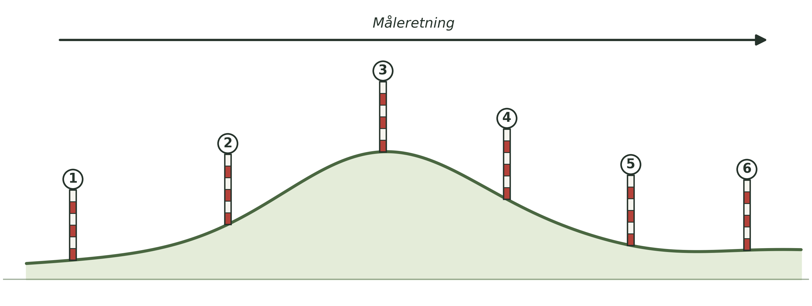
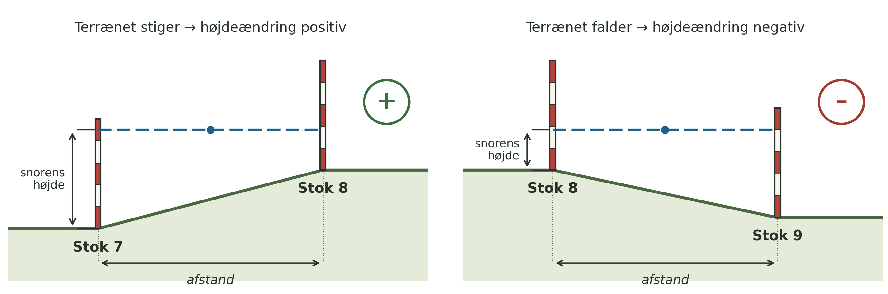

**Dato:** \_\_\_\_\_\_\_\_\_\_\_\_\_\_\_\_\_\_\_\_ &nbsp;&nbsp;&nbsp;&nbsp; **Gruppe / navne:** \_\_\_\_\_\_\_\_\_\_\_\_\_\_\_\_\_\_\_\_\_\_\_\_\_\_\_\_\_\_\_\_\_\_\_\_\_\_\_\_\_\_\_\_

## Om øvelsen

I dag skal I opmåle et terrænprofil, så I bagefter kan tegne terrænformerne langs profilet.

Øvelsen udføres på volden ved den gamle swimmingpool øst for gymnasiet, samt på plænerne omkring den.

{#fig-terraen}

## Fremgangsmåde

1. Sæt landmålerstokkene i en lige række hen over terrænet, i den retning I vil måle profilet (se @fig-terraen).
2. Spænd snoren mellem de to forreste stokke, og brug vaterpasset til at sikre, at snoren hænger helt vandret (i vater).
3. Mål den vandrette afstand mellem de to stokke med målebåndet, og skriv den ind i skemaet.
4. Mål højden fra jorden op til snoren ved hver af de to stokke, med meterstokken eller det korte målebånd (se @fig-maalemetode).

{#fig-maalemetode}

5. Beregn højdeændringen som forskellen mellem de to målte højder. Husk fortegn: positiv (+), hvis terrænet stiger, og negativ (–), hvis det falder.
6. Er højdeforskellen mellem to stokke større end stokkenes egen højde, skal I sætte en eller flere ekstra stokke ind imellem, så I kan måle højdeændringen i mindre trin.
7. Flyt jer én strækning frem, og gentag målingerne, indtil hele profilet er opmålt.

::: {.callout-tip}
## Tip

Dobbelttjek at snoren er helt i vater, før I aflæser højden på stokken — en skæv snor giver en forkert højdeændring. Læs af i øjenhøjde, ikke skråt oppefra eller nedefra.
:::

::: {.callout-note}
## Materialer (pr. gruppe)

- 5–6 rød- og hvidstribede landmålerstokke
- Et flere meter langt stykke snor
- Et vaterpas
- En meterstok
- Et 30 m målebånd
- Et 3 m målebånd (eller et symålebånd)
:::

## Registrering af målinger

| Strækning | A (1-2) | B (2-3) | C (3-4) | D (4-5) | E (5-6) |
|:---|:---:|:---:|:---:|:---:|:---:|
| Afstand (m) | | | | | |
| Snorens højde på første stok (cm) | | | | | |
| Snorens højde på anden stok (cm) | | | | | |
| **Beregnet højdeændring (cm)** — HUSK FORTEGN! | | | | | |

: Måleresultater. Husk fortegn ved højdeændringerne!

*Sætter I ekstra stokke ind undervejs, tilføjes ekstra kolonner i hånden.*
