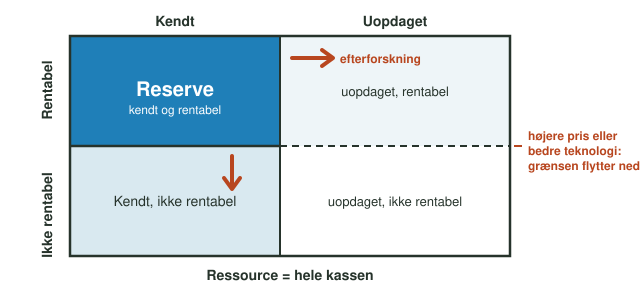
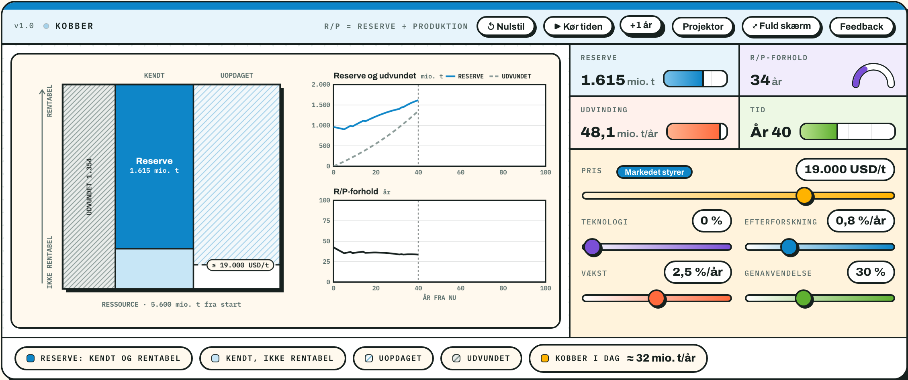

::: {.content-visible when-format="typst"}
**Dato:** \_\_\_\_\_\_\_\_\_\_\_\_\_\_\_\_\_\_\_\_ &nbsp;&nbsp;&nbsp;&nbsp; **Gruppe / navne:** \_\_\_\_\_\_\_\_\_\_\_\_\_\_\_\_\_\_\_\_\_\_\_\_\_\_\_\_\_\_\_\_\_\_\_\_\_\_\_\_\_\_\_\_
:::

## Om øvelsen

Den grønne omstilling kræver store mængder metal — kobber til ledninger, vindmøller og elbiler er et af de vigtigste. Løber vi tør? I denne øvelse undersøger I spørgsmålet med en simulering af kobber. I skal finde ud af, hvad der bestemmer, hvor stor reserven er, hvad R/P-forholdet kan og ikke kan fortælle, og hvorfor verden indtil nu ikke er løbet tør for et eneste råstof.

## Baggrund

En **ressource** er al den forekomst af et råstof, der findes — både den, vi kender, og den, der endnu ikke er opdaget, og både den, der kan betale sig at udvinde, og den, der ikke kan. En **reserve** er den del af ressourcen, der er *både* kendt *og* økonomisk rentabel at udvinde ved den nuværende pris og teknologi (@fig-kassen).

{#fig-kassen width="92%"}

Reserve-/produktionsforholdet (R/P-forholdet) angiver, hvor mange år reserven vil række, hvis produktionen fortsætter som nu:

$$\text{R/P} = \frac{\text{reserve}}{\text{årlig produktion}}$$

I simuleringen er tallene afrundede tal for kobber: en reserve på ca. 1.000 mio. t, en kendt ressource på 2.100 mio. t og ca. 3.500 mio. t, der endnu ikke er opdaget. Forbruget er ca. 32 mio. t om året, og ca. 30 % dækkes af genanvendt kobber — resten skal brydes i miner. Modellen lader en højere pris dæmpe forbruget en smule og give mere efterforskning.

{#fig-simulering width="100%"}

::: {.callout-note}
## Materialer

- Computer med internetadgang
- Simuleringen *Reserve og ressource*: <https://smbi.dk/geografi/raastoffer.html>
- Regneark eller millimeterpapir til grafen
:::

::: {.callout-tip}
## Tip

Tryk **↺ Nulstil** før hver ny del, så I starter i år 0. Nulstil sætter tiden tilbage, men ikke skyderne — dem stiller I selv. Udgangsværdierne er: pris 9.000 USD/t, teknologi 0 %, efterforskning 0,8 %/år, vækst 2,5 %/år og genanvendelse 30 %. Knappen **+1 år** går ét år frem ad gangen.
:::

## Hypotese

Før I går i gang: Hvor mange år tror I, verdens kobberreserve rækker? Og tror I, at reserven bliver mindre, jo mere vi bruger? Begrund kort.

::: {.content-visible when-format="typst"}

\_\_\_\_\_\_\_\_\_\_\_\_\_\_\_\_\_\_\_\_\_\_\_\_\_\_\_\_\_\_\_\_\_\_\_\_\_\_\_\_\_\_\_\_\_\_\_\_\_\_\_\_\_\_\_\_\_\_\_\_\_\_\_\_\_\_\_\_\_\_\_\_\_\_\_\_\_\_\_\_\_\_\_\_\_\_\_\_\_\_\_\_\_\_\_\_

\_\_\_\_\_\_\_\_\_\_\_\_\_\_\_\_\_\_\_\_\_\_\_\_\_\_\_\_\_\_\_\_\_\_\_\_\_\_\_\_\_\_\_\_\_\_\_\_\_\_\_\_\_\_\_\_\_\_\_\_\_\_\_\_\_\_\_\_\_\_\_\_\_\_\_\_\_\_\_\_\_\_\_\_\_\_\_\_\_\_\_\_\_\_\_\_

:::

## Fremgangsmåde

**Del 1 — Prisen.** Stil prisen på hver af værdierne i @tbl-1 (de andre skydere står på udgangsværdierne). Aflæs reserven, udvindingen og R/P-forholdet, og skriv dem i skemaet. Læg mærke til, hvad der sker med den vandrette streg i kassen.

**Del 2 — Teknologien.** Sæt prisen tilbage på 9.000 USD/t. Skru på *Teknologi*, der gør udvindingen billigere, og aflæs reserven ved værdierne i @tbl-2.

**Del 3 — Genanvendelsen.** Sæt teknologien tilbage på 0 %. Skru på *Genanvendelse*, og aflæs udvindingen og R/P-forholdet ved værdierne i @tbl-3.

**Del 4 — Tiden går.** Nu skal I se, om R/P-forholdet holder som prognose. Kør de fire scenarier i @tbl-4. Indstil skyderne, tryk **↺ Nulstil**, og notér R/P-forholdet i år 0. Gå derefter frem med **+1 år** (eller **▶ Kør tiden** og pause), og notér reserven i år 20 og det år, hvor instrumentet *Udvinding* første gang melder om mangel.

- **A:** vækst 0 %/år, efterforskning 0 %/år, fast pris 9.000 USD/t
- **B:** vækst 2,5 %/år, efterforskning 0 %/år, fast pris 9.000 USD/t
- **C:** vækst 2,5 %/år, efterforskning 0,8 %/år, fast pris 9.000 USD/t
- **D:** som C, men med knappen **Markedet styrer** slået til, så prisen stiger, når reserven bliver knap. Notér også prisen i år 20 og år 50.

**Del 5 — Jeres egen strategi.** Start fra scenarie C. Find en kombination af teknologi og genanvendelse (prisen må ikke ændres), der undgår mangel i alle 100 år — eller kommer så tæt på som muligt. Notér jeres indstillinger og resultatet i @tbl-5.

## Registrering af målinger

| Pris (USD/t) | 5.000 | 7.000 | 9.000 | 12.000 | 15.000 | 20.000 |
|:---|:-:|:-:|:-:|:-:|:-:|:-:|
| Reserve (mio. t) | | | | | | |
| Udvinding (mio. t/år) | | | | | | |
| R/P-forhold (år) | | | | | | |

: Del 1 — reserven ved forskellige priser (teknologi 0 %, genanvendelse 30 %). {#tbl-1}

| Teknologi (lavere omkostning, %) | 0 | 10 | 20 | 30 | 40 | 50 |
|:---|:-:|:-:|:-:|:-:|:-:|:-:|
| Reserve (mio. t) | | | | | | |

: Del 2 — reserven ved bedre teknologi (pris 9.000 USD/t). {#tbl-2}

| Genanvendelse (%) | 0 | 30 | 50 | 80 |
|:---|:-:|:-:|:-:|:-:|
| Udvinding (mio. t/år) | | | | |
| R/P-forhold (år) | | | | |

: Del 3 — genanvendelse, udvinding og R/P-forhold (pris 9.000 USD/t). {#tbl-3}

| Scenarie | R/P i år 0 (år) | Reserve i år 20 (mio. t) | Første år med mangel | Pris i år 20 / år 50 (USD/t) |
|:---|:-:|:-:|:-:|:-:|
| A: ingen vækst, ingen efterforskning | | | | — |
| B: vækst, ingen efterforskning | | | | — |
| C: vækst og efterforskning | | | | — |
| D: som C, markedet styrer prisen | | | | |

: Del 4 — fire scenarier over tid. {#tbl-4}

| Teknologi (%) | Genanvendelse (%) | Første år med mangel (eller «ingen») | Reserve i år 100 (mio. t) |
|:-:|:-:|:-:|:-:|
| | | | |
| | | | |
| | | | |

: Del 5 — jeres egne forsøg med scenarie C som udgangspunkt. {#tbl-5}

## Databehandling

1. Kontrollér simuleringens R/P-forhold: beregn selv R/P ud fra reserven og udvindingen for tre af kolonnerne i @tbl-1, og sammenlign med det aflæste tal.

$$\text{R/P} = \frac{\text{reserve}}{\text{udvinding pr. år}}$$

2. Tegn en graf med prisen på x-aksen og reserven på y-aksen (@tbl-1). Beskriv kurvens form: vokser reserven lige meget for hver 1.000 USD/t, prisen stiger? Hvordan passer det med @fig-kassen?

3. Beregn for hver teknologiværdi i @tbl-2, hvor mange procent reserven er vokset i forhold til 0 %:

$$\text{Ændring i reserve (\%)} = \frac{R - R_0}{R_0} \cdot 100\ \%$$

hvor $R_0$ er reserven ved 0 %. Sammenlign med prisen: Hvilken pris i @tbl-1 giver omtrent samme reserve som 30 % billigere udvinding?

4. Udvindingen er den del af forbruget, der ikke dækkes af genanvendelse. Beregn den forventede udvinding for hver kolonne i @tbl-3 ud fra et forbrug på 32 mio. t/år, og sammenlign med det aflæste tal:

$$\text{udvinding} = \text{forbrug} \cdot \left(1 - \frac{\text{genanvendelse i \%}}{100}\right)$$

5. Sammenlign for scenarie A–D i @tbl-4 R/P-forholdet i år 0 (prognosen) med det år, hvor manglen faktisk opstod. Beregn forskellen i år, og forklar for hvert scenarie, hvorfor prognosen ramte for lavt, for højt eller rigtigt.

## Journalspørgsmål

1. Forklar forskellen på en reserve og en ressource med jeres egne ord, og brug resultaterne fra del 1 og 2 til at forklare, hvorfor reserven ikke er et fast tal.
2. I scenarie C blev der fundet nyt kobber hvert år. Hvorfor kan efterforskning alligevel ikke holde reserven oppe for evigt? Hvad sker der med den uopdagede del af kassen?
3. I scenarie D stiger prisen, når reserven bliver knap. Forklar, hvordan den højere pris påvirker både reserven, efterforskningen og forbruget, og hvorfor det kan holde R/P-forholdet næsten konstant i mange år.
4. Kobbers R/P-forhold har i årtier ligget omkring 30–45 år, selvom der hvert år er brudt mere kobber end året før. Forklar det ud fra jeres resultater. Betyder det, at vi aldrig kan løbe tør?
5. Hvilken rolle spiller den cirkulære materialestrøm for, hvor længe et råstof rækker? Brug del 3 og del 5, og nævn, hvad der i virkeligheden gør det svært at genanvende metaller fra fx elektronik.
6. Modellen ser kun på geologi, pris, teknologi og forbrug. Nævn mindst tre forhold fra virkeligheden, som den ikke tager med — fx kritiske råstoffer, konfliktmineraler, miljøkrav eller politisk ustabilitet i producentlandene — og forklar, hvordan hvert af dem kunne ændre forsyningen af kobber.
7. Hvor sikker er en prognose for råstofforbruget 50 år frem? Diskutér, hvilke af modellens antagelser der er mest usikre, og hvordan det påvirker jeres konklusioner.
