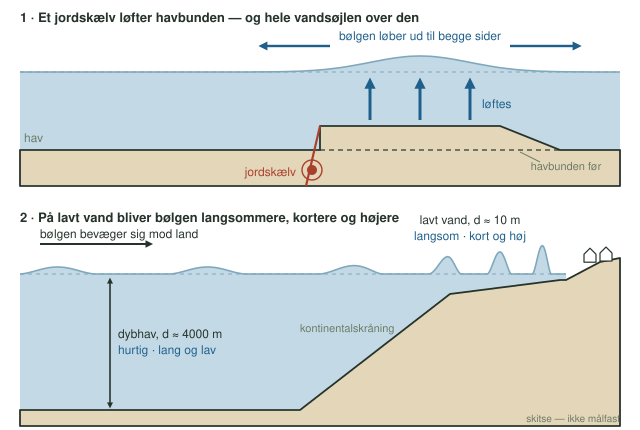
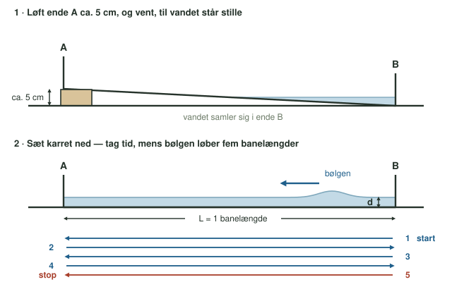

**Dato:** \_\_\_\_\_\_\_\_\_\_\_\_\_\_\_\_\_\_\_\_ &nbsp;&nbsp;&nbsp;&nbsp; **Gruppe / navne:** \_\_\_\_\_\_\_\_\_\_\_\_\_\_\_\_\_\_\_\_\_\_\_\_\_\_\_\_\_\_\_\_\_\_\_\_\_\_\_\_

## Om øvelsen

En tsunami kan krydse et helt ocean på få timer. I denne øvelse undersøger I, hvordan en tsunamibølges hastighed afhænger af vanddybden. I laver bølger i et vandkar ved tre forskellige dybder, måler deres fart og sammenligner med den teoretiske formel. Bagefter bruger I formlen på det rigtige ocean.

## Baggrund

En almindelig bølge skabes af vinden og bevæger kun vandet tæt ved overfladen. En tsunami opstår, når hele vandsøjlen fra bund til overflade flyttes på én gang — fx når et jordskælv løfter en del af havbunden lodret, eller når et stort skred eller et vulkanudbrud skubber vandet til side (@fig-tsunami, øverst).

Tsunamiens bølgelængde er flere hundrede kilometer, altså langt større end havets dybde. Derfor opfører den sig som en bølge på lavt vand, også ude midt på oceanet, og dens hastighed afhænger kun af vanddybden:

$$v = \sqrt{g \cdot d}$$

hvor $v$ er hastigheden i m/s, $g = 9{,}81\ \text{m/s}^2$ er tyngdeaccelerationen, og $d$ er vanddybden i meter.

Når bølgen når ind på lavt vand ved kysten, bremses den. Bølgerne bagved indhenter dem foran, og vandet hober sig op (@fig-tsunami, nederst).

{#fig-tsunami width="100%"}

Bølgen i vandkarret er også en bølge på lavt vand: den er meget længere, end vandet er dybt. Derfor gælder samme formel i karret som på oceanet.

::: {.callout-note}
## Materialer (pr. gruppe)

- Bedroller (lav opbevaringskasse til under sengen) eller et andet aflangt kar med lodrette sider og plan bund
- Tommestok
- Stopur, fx i mobiltelefonen
- En klods eller bog, der er ca. 5 cm høj
- Vand
:::

## Fremgangsmåde

1. Mål karrets indvendige længde $L$. Det er én banelængde. Skriv den over @tbl-1.
2. Stil karret på et vandret bord, og fyld vand i, til dybden er ca. 0,025 m (2,5 cm). Mål dybden så nøjagtigt som muligt, gerne et par steder i karret, og skriv den i @tbl-1.
3. Løft den ene ende (A) ca. 5 cm, fx op på en klods, og vent, til vandet står stille (@fig-opstilling, øverst).
4. Sæt karret ned igen i én rolig bevægelse, og start stopuret i samme øjeblik. Der starter nu en bølge i den ende, der blev stående (B). Den løber mod A, bliver kastet tilbage af den lodrette side og fortsætter frem og tilbage.
5. Stop uret, når bølgen har løbet fem banelængder. Det er, når den rammer ende A for tredje gang (@fig-opstilling, nederst). Skriv tiden i @tbl-1.
6. Gentag trin 3–5, så I har fire målinger ved samme dybde.
7. Gentag det hele med en vanddybde på ca. 0,05 m og ca. 0,10 m.

{#fig-opstilling width="100%"}

::: {.callout-tip}
## Tip

- Tæl højt, hver gang bølgen rammer en ende. Det er let at tælle forkert.
- Bølgen er lettest at se som en skygge på bunden af karret eller som en lysrefleks i overfladen.
:::

## Registrering af målinger

Karrets længde, 1 banelængde: $L$ = \_\_\_\_\_\_\_\_\_ m\
Samlet distance, 5 banelængder: $s = 5 \cdot L$ = \_\_\_\_\_\_\_\_\_ m

| Dybde, ca. | Målt dybde $d$ (m) | Tid, måling 1 (s) | Tid, måling 2 (s) | Tid, måling 3 (s) | Tid, måling 4 (s) |
|:-:|:-:|:-:|:-:|:-:|:-:|
| 0,025 m | | | | | |
| 0,05 m | | | | | |
| 0,10 m | | | | | |

: Rådata: tiden for fem banelængder ved tre vanddybder. {#tbl-1}

## Databehandling

1. Beregn gennemsnittet $\bar{t}$ af de fire tider ved hver dybde.

2. Beregn bølgens målte hastighed ud fra den samlede distance:

$$v_\text{målt} = \frac{s}{\bar{t}} = \frac{5 \cdot L}{\bar{t}}$$

3. Beregn den teoretiske hastighed ved jeres målte dybder:

$$v_\text{teori} = \sqrt{g \cdot d}$$

4. Beregn afvigelsen mellem den målte og den teoretiske hastighed:

$$\text{afvigelse} = \frac{v_\text{målt} - v_\text{teori}}{v_\text{teori}} \cdot 100\ \%$$

| Dybde $d$ (m) | Gennemsnitstid $\bar{t}$ (s) | $v_\text{målt}$ (m/s) | $v_\text{teori}$ (m/s) | Afvigelse (%) |
|:-:|:-:|:-:|:-:|:-:|
| | | | | |
| | | | | |
| | | | | |

: Målt og teoretisk hastighed i vandkarret. {#tbl-2}

5. Tegn en graf med dybden $d$ (m) på x-aksen og hastigheden $v$ (m/s) på y-aksen. Sæt jeres tre målte hastigheder ind som punkter, og tegn den teoretiske sammenhæng $v = \sqrt{g \cdot d}$ som en kurve for dybder fra 0 til 0,12 m.

6. Brug formlen på rigtige havdybder. Regn hastigheden om til km/t ved at gange med 3,6. En tsunami har typisk en periode $T$ (tiden mellem to bølgetoppe) på omkring 18 minutter, og perioden ændrer sig ikke undervejs. Beregn bølgelængden:

$$\lambda = v \cdot T$$

| Dybde $d$ (m) | $v_\text{teori}$ (m/s) | $v_\text{teori}$ (km/t) | Bølgelængde $\lambda$ (km) ved $T$ = 18 min |
|:-:|:-:|:-:|:-:|
| 6000 | | | |
| 2000 | | | |
| 200 | | | |
| 10 | | | |

: Tsunamiens teoretiske hastighed og bølgelængde på oceanet og ved kysten. {#tbl-3}

## Journalspørgsmål

1. Forklar, hvordan en tsunami opstår, og hvordan den adskiller sig fra en almindelig vindskabt bølge.
2. Sammenlign jeres målte hastigheder med de teoretiske. Giv et bud på, hvad forskellene kan skyldes. Tænk fx på reaktionstiden med stopuret, hvor nøjagtigt I kunne måle dybden, om karret stod helt vandret, og om bølgen stadig er meget længere, end vandet er dybt, ved 10 cm.
3. Ved hvilken dybde var afvigelsen størst i procent? Forklar, hvorfor en fejl på 1 mm betyder mere ved den mindste dybde end ved den største.
4. Jeres graf er ikke en ret linje. Beskriv dens form, og forklar ud fra formlen, hvorfor fire gange så stor en dybde kun giver dobbelt så stor en hastighed.
5. Forklar ud fra @tbl-3, hvad der sker med bølgens hastighed og bølgelængde, når den bevæger sig ind mod land og vanddybden bliver meget lille. Hvorfor bliver bølgen højere? Sammenlign jeres svar med tsunamiafsnittet på Naturgeografiportalen.
6. Ved jordskælvet ud for Sumatra i december 2004 ramte tsunamien Sri Lanka ca. 1600 km væk omkring to timer efter skælvet. Det Indiske Oceans gennemsnitsdybde er ca. 4000 m. Passer det med formlen? Hvad kan viden om tsunamiers hastighed bruges til?
7. Bølgen i karret er få centimeter høj og under en meter lang, mens en tsunami er hundreder af kilometer lang. Diskutér, hvor godt vandkarret er som model af en tsunami. Hvad har de to bølger til fælles, og hvad er forskelligt?
