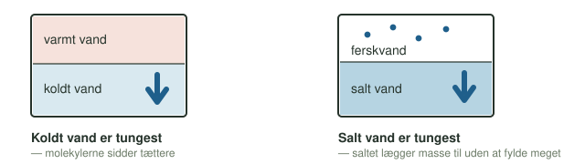
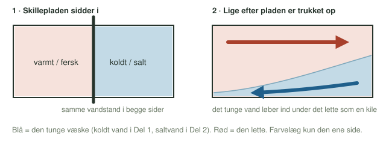

**Dato:** \_\_\_\_\_\_\_\_\_\_\_\_\_\_\_\_\_\_\_\_ &nbsp;&nbsp;&nbsp;&nbsp; **Gruppe / navne:** \_\_\_\_\_\_\_\_\_\_\_\_\_\_\_\_\_\_\_\_\_\_\_\_\_\_\_\_\_\_\_\_\_\_\_\_\_\_\_\_\_\_\_\_

## Om øvelsen

Havvands **densitet** (massefylde) afhænger af to ting: temperaturen og saltholdigheden (salinitet). Begge dele afgør, hvordan vandmasser lægger sig i forhold til hinanden — og dermed hvordan havstrømme som Grønlandspumpen holdes i gang.

I denne øvelse undersøger I de to drivkræfter hver for sig, i et kar med en skilleplade: først en ren temperaturforskel, så en ren saltforskel. Hold øje med, hvad der sker i grænsezonen, når skillepladen trækkes op — og hvor hurtigt det går.

## Baggrund

Densitet er massen pr. rumfang:

$$\rho = \frac{m}{V}$$

Koldt vand er tungere end varmt vand, og salt vand er tungere end fersk vand. To vandmasser med forskellig densitet blander sig ikke uden videre: den tungeste lægger sig nederst, og den letteste flyder ovenpå.

{#fig-densitet width="92%"}

Et sted, hvor de to effekter mødes i virkeligheden, er ved havis: når havvand fryser, bygges saltionerne ikke ind i iskrystallerne — de efterlades i vandet under isen, som derfor bliver både koldt **og** ekstra salt:

{#fig-havis width="100%"}

## Hypotese

Skriv jeres bud, **inden** I går i gang, og begrund med densitet.

Hvad tror I sker, når koldt vand møder varmt vand?

\_\_\_\_\_\_\_\_\_\_\_\_\_\_\_\_\_\_\_\_\_\_\_\_\_\_\_\_\_\_\_\_\_\_\_\_\_\_\_\_\_\_\_\_\_\_\_\_\_\_\_\_\_\_\_\_\_\_\_\_\_\_\_\_\_\_\_\_\_\_\_\_\_\_\_\_\_\_\_\_\_\_\_\_\_\_\_\_\_\_\_\_\_\_\_\_

Hvad tror I sker, når ferskvand møder saltvand?

\_\_\_\_\_\_\_\_\_\_\_\_\_\_\_\_\_\_\_\_\_\_\_\_\_\_\_\_\_\_\_\_\_\_\_\_\_\_\_\_\_\_\_\_\_\_\_\_\_\_\_\_\_\_\_\_\_\_\_\_\_\_\_\_\_\_\_\_\_\_\_\_\_\_\_\_\_\_\_\_\_\_\_\_\_\_\_\_\_\_\_\_\_\_\_\_

::: {.callout-note}
## Materialer (pr. gruppe)

- Gennemsigtigt plexiglas-kar med skilleplade
- Frugtfarve, blå og rød
- Salt (almindeligt bordsalt) og en skål til afvejning
- Vægt til afvejning af salt (husholdningsvægt er nok)
- Lunkent vand og koldt vand
- Sort karton til baggrund
- Stopur
:::

## Fremgangsmåde

### Del 1 — temperaturforskellen alene

**Formål:** at se, hvad en temperaturforskel alene gør ved to vandmasser.

1. Sæt skillepladen midt i karret, og kontrollér, at den slutter tæt.
2. Fyld varmt vand i den ene side og koldt vand i den anden, til samme vandstand i begge sider. Der må ikke være salt i nogen af siderne.
3. Tilsæt blå frugtfarve til den kolde side, så I kan følge den. Rør forsigtigt.
4. Stil sort karton bag karret, og lad vandet falde helt til ro.
5. Træk skillepladen lodret op — roligt og i én bevægelse. Start stopuret.
6. Observér grænsezonen. Notér i @tbl-1, hvad I ser, og hvor lang tid der går, før vandet igen står stille.

{#fig-skilleplade width="100%"}

### Del 2 — saltforskellen alene

**Formål:** at se, hvad en saltforskel alene gør — uden temperaturforskel.

1. Skyl karret, sæt skillepladen i igen, og fyld begge sider med **lunkent vand af samme temperatur**. Det er afgørende: ellers blander I temperatur- og saltforskellen sammen og kan ikke afgøre, hvad der drev bevægelsen.
2. Opløs salt i den ene side ("havsiden"), så saltholdigheden svarer til havvand — ca. 35 gram pr. liter vand i den side. Rør, til saltet er helt opløst.
3. Tilsæt rød frugtfarve til havsiden. Kystsiden er almindeligt fersk, lunkent vand.
4. Lad vandet falde til ro, træk skillepladen op, og start stopuret.
5. Observér, og notér i @tbl-1. Sammenlign med Del 1: ser det ens ud, og går det lige hurtigt?

## Registrering af målinger

| Delforsøg | Det forventede vi | Det så vi | Tid (s) |
|:---|:---|:---|:---:|
| Del 1 — koldt møder varmt | | | |
| Del 2 — salt møder fersk | | | |

: Iagttagelser fra de to delforsøg. {#tbl-1}

## Journalspørgsmål

1. Beskriv med jeres egne ord, hvad I så ske i grænsezonen i Del 1, og forklar det med begrebet densitet.
2. Beskriv, hvad I så i Del 2, og sammenlign med Del 1: gik det hurtigere, langsommere eller ens? Brug forskellen i densitet mellem koldt/varmt vand og salt/fersk vand til at forklare hvorfor.
3. Hvorfor var det vigtigt at bruge lunkent vand af samme temperatur i begge sider i Del 2? Hvad ville der være sket, hvis I i stedet havde brugt koldt vand i den saltede side?
4. Forklar med jeres egne ord, hvorfor havis efterlader saltet i vandet under isen, og hvordan det gør vandet ekstra tungt.
5. Hvilken af de to drivkræfter — temperaturforskel eller saltforskel — tror I betyder mest for en rigtig havstrøm som Grønlandspumpen? Begrund jeres svar ud fra egne observationer.
6. Diskutér fejlkilder: hvad kunne have påvirket, hvor tydeligt eller hvor hurtigt grænsefladen bevægede sig i de to delforsøg?
